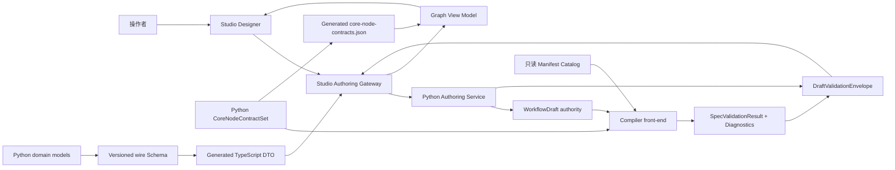

# ZNIKU 0.1.0 Workflow Authoring、Compiler Front-end 与 Studio Projection 基线

- 状态：**已批准的正式基线；Phase 2A 已实现**
- 草案修订：1
- 日期：2026-08-14
- 目标阶段：Phase 2A
- 上位基线：[`product-framework.md`](./product-framework.md)、
  [`studio-framework.md`](./studio-framework.md)
- 正式依赖：[`engine-contract.md`](./engine-contract.md)、
  [`engine-sdk-baseline.md`](./engine-sdk-baseline.md)

## 1. 文档定位

本文冻结 ZNIKU Phase 2A 的 Workflow authoring 领域边界、Compiler front-end 校验职责、
结构化诊断合同及 Python 到 Studio 的单向投影规则。目标是在不实现 Runtime 的前提下，打通：

```text
Python 正式合同
→ Workflow Draft authority
→ Compiler validation
→ 稳定 diagnostics
→ Studio Designer 投影
```

本文细化产品框架的 Phase 2 和 Studio 框架的 GUI-2 准入条件，不改变以下既有顺序：

1. Python 领域合同先成为唯一语义来源；
2. Compiler front-end 先通过独立测试；
3. Studio 再接入正式 authoring 与 validation；
4. ExecutionPlan、freeze 和 Runtime 在各自合同冻结后实施。

GUI-0 仍是 mock-only 交互原型。本文不把其 TypeScript 类型、React Flow 对象、mock Registry、
静态 plan 或模拟 run 提升为正式协议。
本文末尾的 Studio 最小切片只是 GUI-2 的合同接入前段，不宣称已经完成正式 Registry、保存／导入导出
或完整 GUI-2 验收。

产品 Phase 1 已以纯合成 Demux/Mux conformance package 验证 Engine SDK 与 Installed Catalog；真实
媒体执行仍留给 Runtime 稳定后的 Phase 3。Phase 2A 继续只使用纯合成 Manifest fixture，不借此引入
媒体 I/O。Studio 正式切片只有在
所需 GUI-1 基础设施门禁通过后才能进入；第 12 节把该最小基础子集列入 2A-4，但不把它冒充完整 GUI-1
或完整 GUI-2。

## 2. 本阶段决策摘要

Phase 2A 采用“合同驱动的最小纵向切片”，而不是继续 GUI-first，也不是一次完成整个 Phase 2：

- 建立不可变 `WorkflowSpec` 值对象和可变 `WorkflowDraft` authority；
- 建立只负责 authoring-time validation 的 Compiler front-end；
- 复用 Phase 1A 的 Engine、port、scope、cardinality、参数与 digest 语义；
- 建立统一、结构化、可定位且确定排序的 `Diagnostic`；
- 从 Python wire Schema 确定性生成 TypeScript DTO；
- 让 Studio Designer 接入一条真实 Draft edit → validation → diagnostic 链路；
- 暂不产生 `WorkflowRevision`、`ExecutionPlan`、`WorkflowRun` 或任何媒体副作用。

“Compiler front-end 通过”只表示 Draft 满足本阶段静态 authoring 规则，不表示它已经完成 source
preflight、可冻结或可执行。

### 2.1 Phase 1 前置依赖

本文按 Phase 1 正式实现精确引用 `EngineBinding`、PortSpec、单 scope、cardinality、参数 Schema、JCS
与 digest。`engine-contract.md` 第 6 节已经冻结；任何变更必须提升对应合同版本，并同步模型、Schema、
fixtures、投影和测试。

## 3. Authority 与数据流



权威关系固定为：

- Python `WorkflowDraft` 是语义草案的唯一 authority；Phase 2A 只要求 Studio refresh 后恢复，
  不承诺 Python service restart 后的持久 durability；
- Python Compiler 是 WorkflowSpec graph／manifest 合法性、相应 diagnostic severity 与 gate outcome 的
  唯一 authority；
- Python Authoring service 是 revision、幂等与命令接受／拒绝结论的唯一 authority；wire adapter 是
  raw payload parse 结论的唯一 authority；二者复用同一 Python Diagnostic 合同；
- Python `CoreNodeContractSet` 是 Source／Final 端口的唯一 authority；Studio 不得按 node kind 手写重建；
- Manifest Catalog 只提供已知 manifest 的精确只读解析，本阶段不是 Registry 实现；
- Studio 只持有 authority snapshot 的投影、未确认的输入状态和 `EditorState`；
- React Flow 只负责交互和布局，不是 WorkflowSpec、Compiler 或持久状态；
- GUI 关闭、重载或请求乱序不得改变 Draft authority。

## 4. 正式对象及职责

| 对象 | 所有者 | Phase 2A 职责 |
| --- | --- | --- |
| `WorkflowSpec` | Workflow domain | 一份闭合、可序列化的电影级编排图快照 |
| `WorkflowDraftSnapshot` | Authoring service | 绑定 draft identity、语义 revision、唯一 WorkflowSpec authority 与同 revision validation |
| `WorkflowNodeSpec` | Workflow domain | Phase 2A 接受 Source、EngineStage 与 Final 的闭合判别联合；Core Operator 名称只保留未来职责 |
| `CoreNodeContractSet` | Workflow domain | 闭合提供 Source／Final 的 Python-owned exact PortSpec，并生成只读 Studio 投影 |
| `WorkflowEdgeSpec` | Workflow domain | 用稳定 node/port ID 表达一条 Artifact 数据边 |
| `PortEndpoint` | Workflow domain | 只绑定 node ID 与 port ID；方向由 edge 的 source/target 位置及权威端口集合确定 |
| `EngineBinding` | Phase 1A Contract Kernel | 精确绑定 engine ID、SemVer 与 manifest digest；不得复制实现 |
| `AuthoringCommand` | Application layer | 对某一 Draft revision 提交一个原子 typed edit intent |
| `SpecValidationResult` | Compiler front-end | 只绑定 spec digest、验证合同版本、gate outcome 与 diagnostics；不感知 Draft |
| `DraftValidationEnvelope` | Authoring service | 将纯 Compiler 结果绑定到精确 draft ID 与 subject revision |
| `Diagnostic` | Python diagnostic contract | 用稳定 code 和 typed entity reference 表达一个可定位结论 |
| `WireParseFailure` | Wire adapter | raw payload 无法形成 typed command 或 WorkflowSpec 时返回诊断，不伪造身份／digest |
| `AuthoringCommandRejected` | Authoring service | 已结构解析的命令因幂等冲突、stale revision 或原子应用失败而被拒绝 |
| `EditorState` | Studio authoring boundary | 保存布局与查看偏好，不进入 WorkflowSpec 或语义 revision |

`WorkflowRevision`、`ExecutionPlan` 和 `WorkflowRun` 仍保留上位基线中的职责，但不在 Phase 2A
创建或伪造。当前 GUI-0 中的 freeze、plan digest 和 run state 继续明确标为 mock。

## 5. WorkflowSpec 合同边界

### 5.1 根级要求

`WorkflowSpec` 至少必须表达：

```text
workflow_contract_version
workflow_id
nodes[]
edges[]
```

具体字段实现必须满足：

- `workflow_contract_version` 只路由 WorkflowSpec 合同；首版候选值为 `0.1.0`；
- `workflow_id`、node ID 和 edge ID 稳定、非空且在各自命名空间唯一；
- 所有对象关闭未知字段，未知版本、node kind、operator kind 和枚举默认 fail closed；
- nodes 与 edges 的数组位置不具有执行语义；重复 ID 在形成 WorkflowSpec 前即失败关闭，只有唯一性
  成立的正式对象才按稳定 ID 生成 canonical form；
- ArtifactSet 成员的业务顺序仍由 Phase 1A 模型保持，绝不能被图集合归一化规则重排；
- WorkflowSpec 的所有正式字段参与 canonical JSON；`EditorState` 完全排除；
- Draft spec digest 是内容身份，不是 WorkflowRevision、ExecutionPlan 或 freeze authority。

### 5.2 节点联合

完整产品长期保留 Source、EngineStage、Core Operator 与 Final 四类职责。Phase 2A 的正式
`WorkflowNodeSpec` 使用显式 discriminator，只接受下列 Source、EngineStage 与 Final 三种闭合 variant；
`operator` 在 Core Operator Contract 冻结前仍是未知 kind，必须失败关闭。

#### Source

- 只表示一个 source binding slot 及其核心输出合同；
- Phase 2A 候选核心合同固定为一个 `port_id = "program"` 的 output：
  `ArtifactType.MEDIA / MediaKind.PROGRAM_MEDIA / Scope.PROGRAM / Cardinality.ONE`；
- 不保存本机绝对路径、媒体 payload、探测结果、凭据或 authority token；
- 真实媒体绑定与 preflight 留给后续 Binding / Compiler 专题。

#### EngineStage

- 保存稳定 node ID、精确 `EngineBinding` 与完整惰性参数对象；该 node ID 是未来
  Engine-backed `StageRun.stage_spec_id` 的唯一来源；
- Phase 2A 的 EngineManifest 已固定到一个精确 scope，StageSpec 不再保存一份可能冲突的 scope；
- 输入输出端口由绑定的 `EngineManifest` 提供，WorkflowSpec 不复制另一份 PortSpec；
- manifest 无法解析、版本或 digest 不一致时失败关闭；
- Compiler 对参数是否满足 Manifest Schema 的判断必须复用 `EngineManifest.validate_parameters()`，不得
  实现第二套 Schema 规则；EngineStage 值对象本身只深冻结结构安全的惰性 JSON，不能因此拒绝可编辑的
  Schema-invalid 中间状态；
- 参数的冻结、惰性 JSON 与执行语义键防御必须提取并复用 Contract Kernel 逻辑，不得复制
  `StageRun.parameters` validator。

#### Core Operator（保留的后续职责）

- 只能使用后续专题冻结的闭合 Python Core Operator Contract；是否为 operator 建立独立版本、注册机制及
  具体字段形态不在本文提前决定；
- Partition、Map、Select、Passthrough、Collect、Reduce 属于 Runtime 图操作，不得伪装成 Engine；
- operator 的端口、scope 变换、selector 和集合规则必须由 Python Core Operator Contract 提供；
- 在该合同专题冻结前，Phase 2A parser 与正式纵向切片不得私自实现或接受这些 operator。

#### Final

- 是唯一终端类别，不是 Mux 或通用 Engine；
- Phase 2A 候选核心合同固定为一个必需的 `port_id = "program"` input：
  `ArtifactType.MEDIA / MediaKind.PROGRAM_MEDIA / Scope.PROGRAM / Cardinality.ONE`，且没有 output；
- 端口由 Python 核心合同提供，不由 Studio mock 定义；
- `program` 是 node-local machine identity；可本地化 label 不参与 endpoint 引用；
- Phase 2A 只校验唯一性、终端性和静态输入兼容，不执行发布。

### 5.3 边与端口

每条 `WorkflowEdgeSpec` 必须含稳定 edge ID、source endpoint 与 target endpoint。endpoint 使用稳定
node ID 和 port ID，不能依赖：

- React Flow handle 坐标；
- DOM identity；
- 数组索引；
- `${source}-${target}` 这类可能碰撞的显示拼接；
- 可变 label。

边只表示 Artifact / ArtifactSet 数据流。Phase 2A 不开放任意控制依赖线。Compiler 内部未来生成的
屏障或调度依赖不会写回 WorkflowSpec。

### 5.4 Draft 可以不完整，但不能 malformed

WorkflowDraft 可以暂时包含以下语义问题，并由 diagnostics 表达：

- 必需端口尚未连接；
- 图中存在 cycle；
- Engine 参数尚未满足 Schema；
- Final 缺失或多于一个；
- type、media kind、scope 或 cardinality 不兼容；
- 节点尚未连到通往 Final 的有效路径。

这包括“参数 JSON 结构安全、但尚未满足 Engine Schema”的中间状态：它可以形成新的 Draft revision，
但必须得到阻塞 diagnostic。Compiler 不得静默转换类型或注入 default。参数本身不是合法 JSON 对象、
含非 canonical 值或执行入口语义键时，仍属于下面的结构失败，不能进入 authority。

以下输入不属于“可编辑的不完整 Draft”，必须在解析或命令边界直接拒绝，且不得产生部分 mutation：

- malformed JSON、重复对象键或未知字段；
- 非法 ID、未知 contract version 或未知 node kind；
- 被 Phase 1A execution-semantics key policy 拒绝的结构，或模型未声明的 `shell`、`argv`、
  `executable`／`entrypoint` 字段；惰性字符串内容仍按第 8.3 节处理；
- React Flow Node / Edge 原始序列化对象；
- 不符合 typed command shape 的任意 patch。

## 6. Phase 2A 最小正式图子集

为避免在一个阶段内同时发明集合 operator、ExecutionPlan 和 Runtime，首个正式纵向切片只验收：

```text
Source → program_media-to-program_media Engine(s) → Final
```

它必须能够证明：

- 多命名 typed ports 来自真实 EngineManifest；
- 首个 fixture 使用纯合成、`Scope.PROGRAM`、`MediaKind.PROGRAM_MEDIA → PROGRAM_MEDIA` manifest；
- Engine ID、版本和 digest 精确绑定；
- 合法连接可以保存；
- type、media kind、scope、cardinality、参数或 Final 错误由 Python 返回权威 diagnostic；
- Studio 能定位并修正错误；
- 刷新 Studio 后仍从 Python authority 恢复相同 Draft。

该子集不是产品对 WorkflowSpec 的永久限制。加入 Partition、Map、Select、Passthrough、Collect 或
Reduce 前，必须先以本文修订或独立 Core Operator Contract 冻结其精确集合语义和端口合同。

## 7. WorkflowDraft authority 与编辑命令

### 7.1 Snapshot

Authoring service 返回的正式 snapshot 至少绑定：

```text
result_kind                 draft_snapshot
authoring_contract_version
draft_id
spec_revision
spec
validation
```

- `spec_revision` 是当前 Draft 的单调语义修订号；
- 任何节点、边、Engine binding、参数或其他 WorkflowSpec 变化都会产生新 revision；
- 节点位置、viewport、面板宽度等只改变 `EditorState`，不增加 spec revision；
- `validation` 必须是精确绑定当前 `draft_id + spec_revision` 的 `DraftValidationEnvelope`；
- snapshot 只保存一份 `spec`，Compiler result 与 envelope 都不得复制 WorkflowSpec 或生成另一份
  validated snapshot；
- `validation.result.spec_digest` 必须等于当前 `spec.sha256_digest()`，否则整个 snapshot 失败关闭；
- Studio 必须按 revision 处理乱序返回，丢弃比当前 authority projection 更旧的 snapshot。

Phase 2A 冻结为同步 validation：每个结构合法的语义命令先产生候选不可变 WorkflowSpec，Compiler 在同一
命令事务中完成校验，然后 Authoring service 原子提交新 revision、候选 spec 与匹配的 validation envelope。
语义无效但结构合法的候选可以作为带阻塞 diagnostics 的新 Draft revision 保存；parse 失败、Compiler
内部失败或无法形成完整 result 时不得提交 revision。本阶段因此不存在 snapshot 携带上一 revision 结果或
`validation_pending` 的中间正式状态。这里的“同步”只冻结领域事务语义，不要求特定线程、进程或 HTTP
实现；网络响应仍可能乱序，Studio 继续以 revision 对账。

### 7.2 Typed command

每个语义写命令至少绑定：

```text
authoring_contract_version
command_id
draft_id
base_revision
intent
```

首批 intent 只允许闭合的领域操作，例如：

- 添加或删除节点；
- 连接或断开端口；
- 更换精确 Engine binding；
- 替换完整、已解析的参数对象。

不接收 JSON Patch、任意字段路径修改、React Flow 对象或可执行字符串。命令必须满足：

- 原子应用：失败时 Draft 保持原 revision；
- Phase 2A 的正式 node ID 与 edge ID 均由 Python Authoring service 分配；Studio 只提交 typed intent，
  不提交领域 ID 候选，分配算法本身留在 Python 实现边界；
- ID 分配与成功结果受 `command_id` 幂等保护，重试不能生成第二个 node 或 edge；
- stale `base_revision` 失败关闭；首版不自动合并；
- 成功后返回新的完整 authority snapshot，不让前端局部缓存成为事实；
- node/edge ID 不得由 React 生命周期、数组索引或显示 label 决定。

幂等检查顺序与冲突语义固定为：

1. typed command 解析成功后，先按 `command_id` 查询已记录 outcome，再检查 `base_revision`；
2. 同一 `command_id` 与相同 canonical command payload 必须返回先前记录的结果，不重放 mutation；
3. 同一 `command_id` 与不同 canonical payload 必须失败关闭；
4. 只有首次出现的 command 才继续执行 stale revision 检查和候选 spec 构造。

canonical command payload 按 Phase 1A 的 JSON domain 与 JCS 规则形成，包含 `draft_id`、`base_revision` 和
完整 typed intent，不包含 transport header、重试次数或到达时间。Studio 收到幂等重放返回的较旧
snapshot 时仍按 revision 丢弃，随后刷新当前 authority；
不得为了追求“最新”而把旧 command 重新应用到新 revision。

Studio 可以做可见的 optimistic pending 交互，但 pending state 不能进入 Compiler、freeze 或正式保存；
后端拒绝后必须使用 fresh snapshot 回滚或重建。

## 8. Compiler front-end 职责

### 8.1 输入

Compiler front-end 只接受已经通过结构解析的 `WorkflowSpec`、精确 Phase 1A manifest authority 和
Python core node contracts。它不得读取媒体、目录、Studio state 或 mock data。

面向 wire payload 的公共 facade 仍必须把 parse failure 转换为统一 `Diagnostic` 信封；不得把
Pydantic `ValidationError`、`ContractViolation` 堆栈或需要解析的中文异常文本暴露给 Studio。
`SpecValidationResult` 只用于已经形成正式 WorkflowSpec 的输入；它拥有 spec digest，但不接收或返回
draft ID 与 revision。Authoring service 才能创建 `DraftValidationEnvelope`。

公共 authoring response 是按 `result_kind` 判别的闭合 wire 联合，首版只接受 `draft_snapshot`、
`command_rejected` 与 `wire_parse_failure`。每个 variant 都携带服务端响应使用的
`authoring_contract_version`；未知 discriminator 或版本失败关闭，不允许按字段猜测 variant。

- `WireParseFailure` 至少包含 `result_kind = wire_parse_failure`、`authoring_contract_version`、
  `diagnostic_contract_version`、调用方提供的 correlation identity（若有）与 diagnostics；它不得伪造
  draft ID、subject revision 或 spec digest，根级问题使用 document ref；
- `AuthoringCommandRejected` 只回显能够安全解析的 command/draft/revision identity，并返回当前 authority
  revision（若已知）、`result_kind = command_rejected`、响应使用的 `authoring_contract_version` 与
  `diagnostic_contract_version` 及 diagnostics；缺失身份保持缺失，不用占位字符串冒充；
- malformed JSON、重复 key、未知根版本或不符合 typed command shape 的 payload 使用 parse diagnostic；
  只有能安全提取 command correlation 时才使用 command ref，否则使用 document ref。已经结构解析但因
  幂等、stale revision 或原子应用失败而拒绝的命令使用 authoring diagnostic 与 command ref。两类
  failure envelope 都不是 `SpecValidationResult` 或 Draft snapshot。

### 8.2 Validation gates

校验分为三个本阶段 gate 和一个后续 gate：

1. **Parse gate**：版本、闭合字段、判别联合、ID 及其唯一性、重复 JSON key 与 canonical domain；
2. **Draft graph gate**：引用、方向、cycle、输入基数、唯一 Final 与 Source→Final 连通性；
3. **Manifest contract gate**：EngineBinding authority、ports、scope 与参数 Schema；
4. **Source-bound compile / preflight**：实际媒体、chapter、selector、集合展开；明确延期。

无法解析的 authority 不继续运行依赖该对象的派生检查，避免制造级联噪声；其他互相独立的错误应在
一次 validation 中尽量完整收集。
重复 node/edge ID 属于结构拒绝，不能进入 Draft authority；只有通过唯一性检查后才能按 ID
canonical sort，避免重复 ID 让原始数组顺序重新影响 digest 或 endpoint 解析。

### 8.3 必须校验

Phase 2A 至少执行：

1. contract version 与所有稳定 ID；
2. node / edge ID 唯一性；
3. endpoint 引用、port 方向和 port 存在性；
4. 自连接与 DAG cycle；
5. Engine ID、精确版本和 manifest digest；
6. Engine scope 与参数 Schema；
7. input 连接基数：`one` 与 `set` 必须精确一条入边，`optional` 允许零或一条；
8. output→input 的 ArtifactType、MediaKind、Scope 与 Cardinality 兼容；
9. 至少一个 Source；Final 恰好一个、没有输出边且是全图唯一终端；
10. 每个正式节点都位于从某个 Source 通往 Final 的路径上；
11. 未知 node/operator/Engine/字段默认失败关闭；
12. WorkflowSpec 不提供 source/media/executable path、凭据、shell 或可执行入口字段。

另外固定以下 edge 规则：Source 不得有入边，Final 不得有出边；同一 endpoint pair 的重复边拒绝；
output 可以 fan-out 给多个消费者，但每条保留分支都必须重新进入通往唯一 Final 的祖先图。`set` input
表示一条边携带一个完整 ArtifactSet 值，不表示同一 input 可以接收任意多条边。

PortSpec、scope、cardinality 和参数校验必须调用 Phase 1A 公共语义，不复制判断矩阵。
Engine 参数字符串仍是受 parameter Schema 约束的惰性数据；Phase 2A 不声称能凭字符串内容识别所有
路径或脚本。后续 Runtime 只能通过 allowlisted Engine policy 使用资源，绝不能 shell-interpolate 参数。

### 8.4 当前不作出的结论

未绑定真实 source Artifact 时，Compiler front-end 只能校验声明式静态合同。它不得声称已经证明：

- 实际媒体满足 Engine preconditions；
- 任意两个 JSON Schema 之间存在一般蕴含关系；
- selector 覆盖、ArtifactSet 成员或 chapter plan 完整；
- 工作流已经展开成可执行 StageRun；
- 资源、Engine 安装、人工 handoff 或发布条件 ready；
- Draft 可以冻结、运行或产生媒体副作用。

这些结论属于后续 source binding、Core Operator、ExecutionPlan、preflight 和 Runtime 专题。

### 8.5 确定性

对相同 WorkflowSpec、Manifest authority、`CoreNodeContractSet` digest 与 Compiler 版本，纯 Compiler
validation 必须产生：

- 相同 spec digest；
- 相同 gate outcome；
- 相同 diagnostic code、entity reference 和确定顺序；
- 不依赖 dict 插入顺序、React Flow 布局、系统路径或本地化文案的结果。

Compiler 不修改输入 spec，不静默填默认参数，不自动删除边，也不自动“修复”非法图。
cycle diagnostics 应按 strongly connected component 形成有界、确定的结果，不枚举所有环路。

## 9. Diagnostic 合同

正式 `Diagnostic` 至少包含：

```text
diagnostic_id
stable_code
occurrence_key
severity             info | warning | error
phase                parse | authoring | graph | manifest
entity_ref
related_refs[]
message
details
suggested_action?    受控安全 intent；可选
```

`entity_ref` 使用判别联合，至少覆盖：

- document：可选 JSON Pointer，用于无法形成正式 WorkflowSpec 的根级／字段级 wire 问题；
- command：可选 command ID 与 JSON Pointer，用于无法解析或应用的 typed command；
- workflow；
- node；
- port：node ID、port ID 与 direction；
- edge；
- parameter：node ID 与参数 path。

规则固定为：

- 同一 `stable_code` 可以在多个实体上同时出现；`diagnostic_id` 才是单次结果内的唯一身份；
- `stable_code` 是受 grammar 约束、允许后续新增的机器 token，不是 generated TypeScript 中的闭合 enum；
- `occurrence_key` 是每条规则定义的稳定语义区分符，例如缺失 port ID、冲突 edge ID 组合或 SCC 成员
  digest；singleton 规则使用该规则固定常量，不得使用遍历索引、数组位置或随机值；
- `related_refs` 必须先按 canonical entity-ref bytes 排序，再参与序列化与 identity；
- `diagnostic_id` 由 diagnostic contract version、phase、stable code、primary ref、canonical related refs 与
  occurrence key 确定性派生，不使用随机 UUID，也不包含本地化 message；
- malformed wire payload 使用 `parse` phase；stale revision、同 command ID 不同 payload 与原子应用失败
  使用 `authoring` phase，并以 command ref 作为 primary entity；Workflow 图规则与 Manifest 合同分别使用
  `graph`、`manifest` phase；
- `stable_code`、severity、entity 和 blocking outcome 由 Python 定义，Studio 不得改写；
- 人类文案可本地化，但调用方不得解析 message 获取机器语义；
- `details` 是受约束的惰性 JSON，不携带媒体 payload 或凭据，也不提供 executable authority；
- `suggested_action` 只能引用 allowlisted 安全 action，例如 refresh authority 或 typed edit intent，不能
  携带 shell、代码或任意命令；
- error 必须阻断本阶段 eligibility；GUI 不提供“忽略错误”入口；
- warning 与 info 在 Phase 2A 不阻断 authoring-valid snapshot，但必须保留展示；
- Studio 遇到当前 contract version 下未知 code 时必须保留并展示，遇到未知 severity 或诊断合同版本时
  fail closed；
- 前端即时提示使用独立 `ClientHint`，不得冒充、覆盖或删除 Compiler Diagnostic。

纯 Compiler 返回的 `SpecValidationResult` 至少绑定：

```text
workflow_contract_version
compiler_contract_version
diagnostic_contract_version
spec_digest
core_node_contract_digest
outcome               invalid | authoring_valid
diagnostics[]
```

Authoring service 使用下列 envelope 绑定 Draft 身份：

```text
DraftValidationEnvelope
  authoring_contract_version
  draft_id
  subject_revision
  result              SpecValidationResult
```

`SpecValidationResult`、`DraftValidationEnvelope` 和 `WorkflowDraftSnapshot` 都不得复制 WorkflowSpec，也不
携带 topological projection。snapshot 与 envelope 的 authoring version、draft/revision 必须严格相同，且
`snapshot.spec.sha256_digest()` 必须等于 `result.spec_digest`，否则整个 snapshot 失败关闭。
`result.core_node_contract_digest` 必须等于 Compiler 实际使用的 Python contract set，也必须与 Studio
projection manifest 中的 digest 相同；任一错配时 Studio 禁止展示可连接端口并失败关闭。改变 Source／Final
语义仍必须审阅并提升相应 workflow contract version，digest 对账不能代替版本演进。
`authoring_valid` 只证明 Phase 2A 静态 authoring validation 已通过，不是 WorkflowRevision、freeze stamp 或
ExecutionPlan，不能创建 Run。Studio 不通过本地统计 error 数量推断 gate；只使用 Python 返回的
`outcome`。

版本字段互相独立：

- `workflow_contract_version` 路由 WorkflowSpec；
- `authoring_contract_version` 路由 Draft snapshot、typed command、validation envelope 与 command
  rejection；
- `compiler_contract_version` 路由 validation 行为与 result；
- `diagnostic_contract_version` 路由 Diagnostic / EntityRef 信封；
- `projection_contract_version` 路由投影 manifest；
- ZNIKU 产品版本与 Engine contract version 不替代上述任一字段。

首版数值可以同时从 `0.1.0` 起步，但调用方不得假设它们永远相等或使用产品版本隐式路由。

## 10. Python → Studio 投影

### 10.1 单向生成链

正式链路固定为：

```text
Python domain models
→ versioned wire DTO / JSON Schema
→ generated TypeScript DTO
→ handwritten Studio adapter
→ Graph View Model
→ React Flow Node / Edge

Python CoreNodeContractSet
→ generated core-node-contracts.json
→ handwritten Studio adapter
```

要求：

- Python 模型是唯一语义来源；
- wire DTO 保留正式 snake_case 字段和枚举值；
- generated TypeScript 文件带禁止手改标记；
- Source／Final exact PortSpec 不进入 WorkflowSpec，也不由 adapter 按 node kind 构造；它们从 Python
  `CoreNodeContractSet` 确定性生成 `core-node-contracts.json`，由 Graph View Model 只读消费；
- wire Schema、generated TypeScript DTO、`core-node-contracts.json` 与 projection manifest 作为可审阅的
  版本化产物提交；
  Studio 启动时不得临时生成或从网络下载合同；
- 生成必须确定、可重复，并由 regeneration/diff gate 防止漂移；
- 每次正式投影同时生成 projection manifest，至少记录 source contract versions、generator version、
  source Schema digest、core node contract digest 与生成文件清单；
- Studio 只有在 validation result 与 projection manifest 的 `core_node_contract_digest` 精确相等时才能
  构造 Source／Final handles；不匹配时显示 contract unavailable，不得回退硬编码端口；
- 正式入站 JSON 在进入 adapter 前必须做 runtime validation，不能只依赖 TypeScript 静态类型；该
  validator／guard 必须由同一份 checked-in wire Schema 直接生成或直接驱动，不得手写一套平行 Zod
  或 TypeScript 语义 Schema；
- Pydantic Schema 不能表达的跨对象不变量仍由 Python Compiler 判定；
- codegen 工具与产物目录在实施设计中选择，不改变本节的单向 authority。

领域模型导出的 wire Schema 与 `EngineManifest.parameter_schema` 是两类不同合同：前者描述传输 DTO，
后者约束 Engine 参数值。实现与文档不得混用二者的版本或 authority。

### 10.2 Graph View Model

手写 Graph View Model 可以增加：

- label、icon、position、尺寸和选中状态；
- Inspector 与媒体变化展示摘要；
- diagnostic badge 和 pending 状态；
- React Flow handle 与正式 port reference 的映射。

它必须保留正式 node/edge/port reference，不得合并或改写：

- `artifact_type`、`media_kind`、`scope`、`cardinality`；
- Engine execution mode；
- manifest version 或 digest；
- Compiler diagnostic severity 与 gate outcome。

当前 `model.ts` 中将 `program_video`、`chapter_video_set` 等混入单一 `artifactType` 的结构只属于
GUI-0 mock，不得迁移到正式 DTO。

### 10.3 Mock 隔离

- GUI-0 mock 可保留为明确的演示和组件测试数据源；
- 正式 authoring mode 后端不可用时必须显示 unavailable，禁止静默回退 mock；
- 正式 Designer 切片不得 import `mock-data.ts`；
- Expanded Plan、Freeze 和 Run Monitor 在 Phase 2A 正式模式中隐藏或禁用；
- 它们可以继续存在于显著标记 `MOCK · NO MEDIA I/O` 的演示模式；
- current mock edge ID、React counter node ID、静态 compile preview 和浏览器内 freeze/run 不得复用。

## 11. 传输与进程边界

本文冻结 payload 与 authority，不冻结 URL、FastAPI router、SSE/WebSocket 或进程部署：

- Python 模型和 Compiler 必须可脱离 HTTP 与 Studio 独立测试；
- 首个纵向切片可以通过进程内 adapter 或 loopback request/response 接口完成；
- transport 不能改变命令幂等、revision 并发控制或 diagnostic 语义；
- 本阶段没有 Runtime event；事件流、重连游标和后台服务属于后续专题；
- 正式 API 若后续建立，仍必须 loopback、最小认证并遵守 Studio 安全基线。

## 12. 实施顺序

本文审阅通过后，Phase 2A 应按以下门禁顺序实施。Studio 框架规定 GUI-1 基础设施先于 GUI-2 正式
业务接入；因此 2A-4 必须先补齐并通过本切片所需的 Gateway seam、Graph View Model ↔ React Flow
adapter 与组件测试边界，2A-5 才能进入。该安排只交付本切片依赖的 GUI-1 子集，不宣称完整 GUI-1
或 GUI-2 已完成。

### 2A-1：Authoring Contract

- 实现 WorkflowSpec、node/edge/endpoint 与 Draft snapshot；
- 复用 Phase 1A ContractModel、EngineBinding 与 canonical serialization；
- 用纯合成 fixtures 固定 round-trip、digest、ID 和未知字段失败语义。

### 2A-2：Compiler Front-end

- 实现只读 manifest catalog interface；
- 实现本文件第 8 节的静态校验；
- 实现结构化 diagnostics 与确定排序；
- 不实现 ExecutionPlan 或 Runtime。

### 2A-3：Authoring Service

- 实现 Draft snapshot、typed command、revision 和幂等；
- 使用内存 repository 即可验证语义，暂不冻结数据库；
- 验证 stale revision、重复 command 和原子失败。

### 2A-4：Contract Projection

- 生成 wire Schema 与 TypeScript DTO；
- 从 Python `CoreNodeContractSet` 生成并校验 Source／Final exact port projection；
- 建立 runtime parse 与 generation drift gate；
- 建立 Studio Authoring Gateway seam；
- 建立 Graph View Model ↔ React Flow 显式 adapter 与组件测试边界，不修改领域语义。

### 2A-5：Studio 最小正式切片

- 从 Python authority 加载一个含预置 Source、EngineStage、Final 的纯合成 Draft 和 Manifest；本切片
  不以 Studio 新建 node 为验收项；
- 展示预置正式节点、typed ports 与 Inspector；
- 通过 typed command 完成 edge connect、disconnect 与完整参数对象替换；
- 显示、定位并通过正式 edit 修正 Python diagnostic；
- 正确对账 duplicate command、stale command rejection 与乱序旧 snapshot，不重放 mutation；
- 刷新后恢复相同 Draft；
- 后端不可用时 fail closed；
- 不接入 Plan、Freeze、Run 或媒体 I/O。

任何后一步不得在前一步门禁未通过时自行冻结缺失合同。

## 13. 测试与验收门禁

### 13.1 Python 合同与 Compiler

- 合法最小 WorkflowSpec；
- malformed、未知字段和未知版本；
- node/edge/port ID 重复或悬空引用；
- cycle、自连接、缺失必需输入和无关孤岛；
- typed port、scope 与 cardinality 不兼容；
- Engine ID、版本、digest 或参数错误；
- Final 缺失、重复、非终端或存在其他终端；
- canonical JSON round-trip、node/edge 输入顺序归一化和 digest 稳定；
- diagnostic ID、code、entity 与排序稳定；
- diagnostic occurrence key 与 canonical related refs 可区分同 code／同 primary ref 的多条结论；
- cycle 按 strongly connected component 产生有界确定诊断；
- 任一 error 使 `SpecValidationResult.outcome = invalid`；warning/info 保留但允许 authoring-valid；
- 纯 `SpecValidationResult` 不携带 Draft 身份或 spec 副本，envelope/snapshot identity 与 digest 不匹配时
  失败关闭；
- Compiler result、Python CoreNodeContractSet 与 Studio projection manifest 的 core contract digest
  不匹配时失败关闭；
- 同步 validation 不产生 pending 或跨 revision result；Compiler 失败时不提交 Draft revision；
- Draft command 幂等、同 ID 不同 payload 冲突、幂等检查先于 stale revision，以及失败原子性；
- authoring rejection 使用 `authoring` diagnostic phase，未知 authoring contract version 失败关闭；
- authoring response 的三个 `result_kind` 均可 runtime parse，未知 kind、错配／未知 authoring 或
  diagnostic version、错配字段或伪造 identity 被拒绝；
- React Flow JSON、shell／executable authority 字段或可执行入口结构失败关闭。

门禁至少包括：

```powershell
uv run --locked --extra dev pytest
uv run --locked --extra dev mypy --no-incremental src tests
uv run --locked --extra dev ruff check src tests
uv run --locked --extra dev ruff format --check src tests
uv lock --check
```

还必须运行 wheel 构建与独立安装/import 烟测，确认包含 `py.typed`、不包含 tests/mock，并执行
`git diff --check` 与 `0.1.0` 版本一致性检查。

### 13.2 投影与 Studio

- Python fixture → wire JSON → runtime parse → Graph View Model 一致；
- Python Schema → TypeScript regeneration 无 diff；
- Python CoreNodeContractSet → `core-node-contracts.json` regeneration 无 diff，Studio 不硬编码 Source／Final
  端口；
- Graph View Model 与 React Flow 的 ID / port mapping；
- Studio 不能改写 Compiler error 或 gate outcome；
- 迟到 authority snapshot 不覆盖新 revision；
- 正式 mode 不 import mock data，后端失败不回退 mock；
- React Flow serialization 不能通过 WorkflowSpec parser；
- Designer edit、diagnostic 定位、修正和刷新恢复的组件／集成测试。

修改 Studio 后至少运行：

```powershell
npm run typecheck
npm run test:run
npm run build
```

### 13.3 纵向验收场景

首个正式切片必须证明：

1. Studio 从 Python 投影加载一个 Source → Engine → Final Draft；
2. 合法连接由 Python 接受并产生新 revision；
3. scope、media kind 或 cardinality 错误由 Python 返回稳定 diagnostic；
4. diagnostic 能定位到 edge / port，修正后在新 revision 消失；
5. Engine 参数表单来自真实 parameter Schema；结构安全但 Schema-invalid 的中间值进入新 Draft revision
   后得到阻塞 diagnostic，不能成为 authoring-valid，且不得被静默转换或注入 default；
6. 浏览器刷新后从 Python 恢复相同 spec revision；
7. 请求乱序、重复 command 和 stale revision 不破坏 Draft；
8. Python 服务不可用或 payload 含未知字段时 fail closed；
9. Expanded Plan、Freeze 与 Run 不在正式模式中伪造成功；
10. 全过程不读取或写入媒体，不生成 Evidence、receipt、Final 或 ZBaton。

## 14. 明确非目标

Phase 2A 不实现：

- Core Operator 的精确 Partition / Map / Select / Passthrough / Collect / Reduce 集合语义；
- source path、媒体探测、chapter plan、selector 实例化或 Artifact binding；
- WorkflowRevision freeze、ExecutionPlan 或 expanded StageRun；
- Runtime 状态机、ready set、并发、lease、重试、恢复或 Runtime events；
- Engine Registry 安装、发现、allowlist、执行入口或真实 Engine；
- FastAPI 正式路由、数据库、`.zniku` 工程格式或 CLI；
- Expanded Plan、Run Monitor、Tauri、真实桌面安装包或媒体 I/O；
- Evidence、receipt、Final publication 或 ZBaton producer；
- AVSplitTool 复制、AVEnhanceFlow 修改或旧任务导入。

## 15. 与后续阶段的接口

Phase 2A 完成后，建议继续按独立专题推进：

1. **Core Operator Contract**：冻结集合、selector 与 scope transformation；
2. **Binding / Preflight**：绑定 source authority 和实际媒体合同；
3. **ExecutionPlan**：确定展开、Engine binding、operator instance 与 plan digest；
4. **WorkflowRevision / Freeze**：建立不可变 revision 和 freeze gate；
5. **Runtime**：状态、ready set、执行、Evidence 与恢复；
6. **Studio Plan / Run**：在上述 authority 稳定后接入 Expanded Plan 和 Run Monitor。

这些阶段不得回写或私自扩展 Phase 2A 的 wire contract；需要改变时先修订正式基线并同步模型、Schema、
generated types、fixtures 和测试。

## 16. 本轮审阅决策

批准本文意味着接受以下候选冻结项：

1. 本专题是产品 Phase 2 的 authoring contract 与 Compiler front-end 子成果，只使用合成 Manifest；
2. WorkflowDraft aggregate 指向不可变、结构合法但可暂时语义无效的 WorkflowSpec，并为每个 revision
   同步绑定 validation envelope；
3. Python Authoring Service 是 WorkflowDraft authority；Studio 不直接保存正式领域事实；
4. Draft 使用 `draft_id + spec_revision`，语义命令使用 `command_id + base_revision`；Python 分配正式
   node/edge ID，且同 command ID 的幂等检查先于 stale revision；
5. WorkflowSpec 与 EditorState 完全分离；
6. Phase 2A node union 只接受 Source、EngineStage、Final，Source/Final 使用本文固定 program PortSpec；
7. EngineStage 只保存精确 EngineBinding 和参数，不复制 PortSpec 或当前可派生的 Engine scope；
8. nodes / edges 属于非业务有序集合，canonical form 按稳定 ID 归一化；output fan-out 合法，但所有
   分支必须回到唯一 Final；
9. Compiler 复用 Phase 1A typed port、scope、cardinality 和参数语义；
10. Compiler 返回不感知 Draft 的 `SpecValidationResult`，Authoring service 用
    `DraftValidationEnvelope` 绑定 revision；不创建 validated spec 副本或 validation stamp；
11. Diagnostic 使用可扩展稳定 code、occurrence key、typed entity reference、确定排序和 Python outcome；
12. TypeScript DTO 与 runtime validator 由同一 Python wire Schema 单向生成／驱动；Source／Final exact
    PortSpec 由 Python `CoreNodeContractSet` 生成，Compiler result 与 projection manifest 使用相同 digest
    对账，正式 mode 不回退 mock；
13. 首个正式图子集限定为 Source → `PROGRAM_MEDIA`-to-`PROGRAM_MEDIA`、`Scope.PROGRAM` Engine(s)
    → Final；
14. Core Operator、ExecutionPlan、Freeze、Runtime 与媒体 I/O 明确延期；
15. Studio 只在所需 GUI-1 基础门禁通过后接 Designer 最小正式切片，Plan / Freeze / Run 继续
    mock-only 或禁用；
16. Phase 1 Contract Kernel 的精确协议由 `engine-contract.md` 独立冻结，本文只引用、不复制。

本文已于 2026-08-14 获明确审阅批准；Phase 2A 实现位于 `src/zniku/authoring/`，Python→Studio
投影位于 `apps/studio/src/generated/`，Studio 正式 Designer 接入位于 `apps/studio/src/formal/`。
实现仍严格受第 14 节非目标约束，不因此授权 ExecutionPlan、Runtime、真实 Engine 或媒体 I/O。
