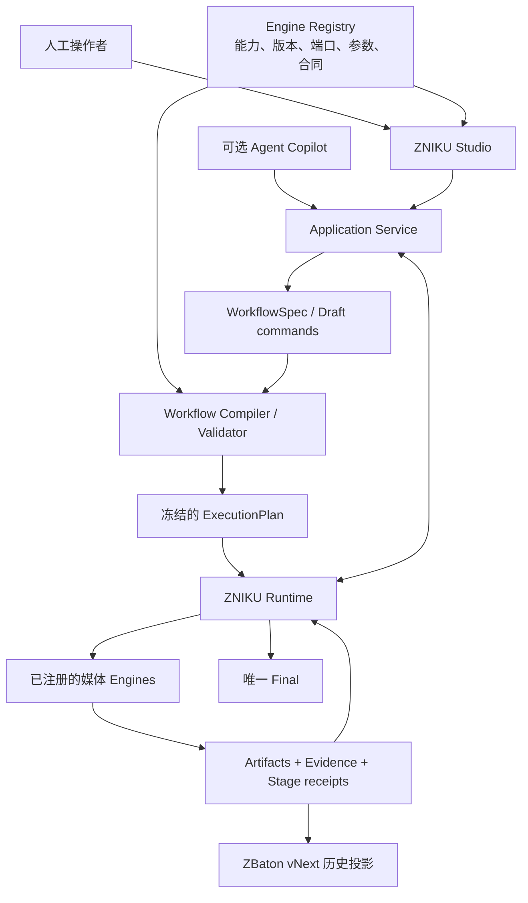
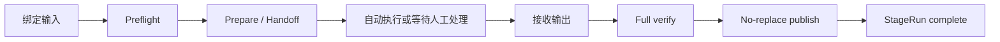
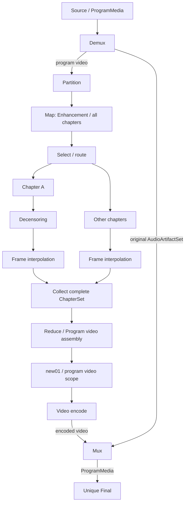

# ZNIKU 0.1.0 产品整体框架

> [!IMPORTANT]
> **0.1.0 历史归档：** 本文只描述 `main@198d802` 的旧实现，对 0.2.0 没有规范权威。当前唯一目标架构
> 见 [`graph-core-baseline.md`](../../architecture/graph-core-baseline.md)。

- 状态：**已采纳的产品框架基线，细节按专题冻结**
- 框架修订：1
- 日期：2026-08-14
- 起始版本：ZNIKU 0.1.0
- 孵化来源：AVEnhanceFlow v3.0 架构设计

## 1. 文档定位

本文定义 ZNIKU 的整体产品方向、系统分层、核心角色、工作流生命周期和实施边界，
作为后续 WorkflowSpec、Engine Contract、ZNIKU Runtime、Agent Skill、图形化编辑器及 ZBaton vNext 集成的
共同起点。

本文只冻结总体框架，不提前冻结具体 JSON 字段、Python API、GUI 技术栈、Engine 打包格式或调度
算法。上述细节必须在后续专题设计中逐项讨论、实现和验证。

本文不修改 AVEnhanceFlow v2.3.1 package 使用的 v2.3.0 workflow contract，也不迁移、续跑或重写
已有任务、Evidence、receipt、final 与 ZBaton。AVEnhanceFlow 继续独立维护其生产工作流。

## 2. 产品定位

ZNIKU 定位为：

> 以 ZNIKU Studio 为主要控制界面、以确定性 ZNIKU Runtime 为执行权威、可由 Agent 辅助编排和运维的
> 本地媒体工作流平台。

目标不是让 Studio、Agent 或 Engine 在运行时临时发明流程，而是把人的设计意图保存为可校验、
可冻结、可恢复、可审计的工作流定义，再由 Runtime 确定性执行。Agent 是可选客户端，不是产品
运行所必需的关键路径。

## 3. 核心原则

1. **人工决定拓扑**：工作流在任务开始前通过图形界面编排并确认。
2. **定义先于执行**：任何媒体副作用前，WorkflowSpec 必须通过校验并编译为冻结的 ExecutionPlan。
3. **Agent 不是完成权威**：Agent 可以解释、询问、监督和请求调用 Engine，但不能绕过 Runtime、
   修改正式状态或凭完成消息放行节点。
4. **Runtime 确定执行**：依赖、ready set、并发、幂等、恢复、事务和完成状态由确定性 Runtime 管理。
5. **Engine 封装处理**：每种媒体处理能力以版本化 Engine 提供，并声明端口、scope、参数和媒体合同。
6. **图操作归 Runtime**：Partition、Map、Select、Passthrough、Collect、Reduce 和 Final 等结构操作
   由核心 Runtime 统一解释，不由媒体 Engine 各自实现。
7. **分层而非全量平铺**：用户编辑电影级 DAG；Runtime 将其展开为章节和叶片级执行 DAG。
8. **证据派生状态**：节点完成必须由正式 Artifact、Evidence 或 receipt 证明，目录和状态文字不是
   authority。
9. **运行定义不可变**：产生第一个媒体副作用后不得原地修改拓扑；变更必须创建新的 revision 或
   下游 Workflow。
10. **Final 唯一终端**：每个 Workflow Run 只有一个 final；final 后继续处理必须新建下游 Workflow。

## 4. 总体架构



系统各层通过版本化合同连接。Studio 与 Agent 都通过 Application Service 使用同一组领域命令；
Studio 不执行媒体，Agent 不持有唯一状态，Engine 不修改工作流拓扑，ZBaton 不承担运行时调度。

## 5. 三层 DAG

### 5.1 编排 DAG

编排 DAG 是用户在 GUI 中看到和保存的电影级工作流。它表达：

- 从哪些 source 开始；
- 如何分章、选择、分支和汇合；
- 每个处理节点使用哪个 Engine；
- 哪些节点作用于全片、章节集合或指定章节；
- 最终由哪个节点生成唯一 final。

编排 DAG 保持可读，不默认展开每个章节和叶片文件。

### 5.2 执行 DAG

Graph Compiler 根据实际 source、章节计划、selector 和 Engine 能力，把编排 DAG 展开为不可变的
ExecutionPlan。执行 DAG 可以包含：

- 每章独立 StageRun；
- 每章内部的叶片 fan-out / fan-in；
- 人工 handoff 与输出接收；
- 集合完整性屏障；
- program 级汇合和最终发布。

Runtime 只执行编译后的明确节点和边，不在运行中凭自然语言猜测拓扑。

### 5.3 历史与证据投影

执行 DAG 产生完整的 Artifact 与 StageRun 记录。它们分别投影为：

- 面向正确性、恢复和审计的 Evidence / receipt；
- 面向用户阅读和跨 Workflow 继承的 ZBaton vNext `processing_history`。

叶片级细节默认保留在 Evidence，ZBaton 重点记录电影级处理历史及必要的处理范围。

## 6. 核心领域对象

以下名称表达职责，正式字段和 API 留待专题设计：

| 对象 | 职责 |
| --- | --- |
| `WorkflowSpec` | GUI 保存的可读编排定义 |
| `WorkflowRevision` | 一次不可变的工作流定义版本 |
| `ExecutionPlan` | 校验并展开后的确定性执行图 |
| `WorkflowRun` | ExecutionPlan 的一次正式运行 |
| `StageSpec` | 图中一个处理节点的配置与连接 |
| `EngineManifest` | Engine 的身份、版本、端口、scope、参数与能力声明 |
| `StageRun` | 某个 StageSpec 在特定 program/chapter/leaf 上的一次执行 |
| `Artifact` | 一份具有稳定身份的媒体或控制产物 |
| `ArtifactSet` | 有顺序、有成员清单、有覆盖范围的 Artifact 集合 |
| `Final` | Workflow Run 的唯一终端媒体及其正式完成记录 |

节点是操作，Artifact 是数据。一个节点可以消费或产生单一 Artifact，也可以消费或产生 ArtifactSet；
不得把“一个文件”强制等同于“一个顶层工作流节点”。

节点可以声明多个具有稳定 ID 的命名输入、输出端口，不能把容器内的全部媒体简化成一个不可拆分的
`video+audio` 端口。典型 program source 经 Demux 后至少产生 `video` 与 `audio_set` 两个独立
Artifact；Mux 则通过独立端口消费编码后视频和完整 AudioArtifactSet。每个端口分别声明 artifact
类型、scope 与基数，由 Compiler 校验连接兼容性和必需输入完整性。

## 7. Scope 与集合

首版至少需要区分三种处理范围：

```text
program    一份完整电影或节目
chapter    一个或多个有序章节
leaf       Engine 内部用于处理或恢复的叶片
```

ArtifactSet 不能只是目录路径，至少必须绑定：

- 集合身份；
- 预期成员和稳定成员 ID；
- 成员顺序；
- 时间或帧覆盖范围；
- 每个成员的 Artifact 身份；
- 完整性和产生它的 StageRun。

Runtime 只有在全部必需成员完成且合同兼容时，才能让 Collect 或 Reduce 节点 ready。

## 8. 图操作与媒体 Engine

### 8.1 Runtime 内建图操作

```text
Partition     单一媒体拆分为有序集合
Map           对集合成员应用一个 StageSpec
Select        从集合选择指定成员或范围
Passthrough   未选择成员保持原输入身份继续传递
Collect       将处理成员与旁路成员重建为完整有序集合
Reduce        将集合汇合为一个 program 媒体
Final         发布 Workflow Run 的唯一终端
```

这些操作负责图结构和集合完整性，不实现 Enhancement、Decensoring 等具体媒体算法。

### 8.2 版本化媒体 Engine

媒体 Engine 负责实际媒体能力，例如：

```text
Video preparation
Demux
Enhancement
Frame interpolation
Decensoring
Audio restoration
Program assembly
Video encode
Mux
未来 new01
```

每个 Engine 必须声明：

- 稳定 `engine_id` 与精确版本；
- 输入、输出端口及媒体类型；
- 支持的 `program`、`chapter` 或 `leaf` scope；
- 参数 Schema 与默认值边界；
- 输入前置条件和输出保证；
- 会改变、保持或无法保证的媒体指标；
- 执行模式：本地自动、人工外部或未来远程；
- 验收、发布和恢复能力。

Engine 不得自行修改 WorkflowSpec、跳过 Runtime gate 或把自然语言完成消息当作成功记录。

## 9. Engine 生命周期

一个逻辑处理节点可以在内部包含多个步骤，但对上游和下游保持统一合同：



当前“人工 Enhancement + build-enhancement-master”在 ZNIKU 中应表现为一个 Enhancement Engine 的完整
生命周期；“人工 Frame interpolation + bind-frame-interpolation”同理。验证和 publication 是节点
完成机制，不需要成为用户编排图中的独立业务节点。

## 10. 分支与汇合示例

以下工作流表示：source 先分离 program video 与原始全部音轨；全部视频章节先 Enhancement，仅 A 章
Decensoring，随后全部章节 Frame interpolation；视频汇合后执行全片 `new01` 和一次 Video encode，
最后与原始 AudioArtifactSet 重新 Mux：



用户可以为不同分支安排不同处理链，但进入同一 Collect / Reduce 的输出必须满足成员唯一、顺序完整、
覆盖连续和媒体合同兼容。原始音频旁路仍是正式数据边，不得靠 Final 隐式恢复；若需要音频处理，可以
在 `audio_set` 支线上显式加入 Select、Map、Audio restoration 与 Collect。Mux 负责容器合成，Final
只负责唯一终端发布。仅满足“有向、无环”不足以形成合法电影。

## 11. Workflow 生命周期

正式生命周期为：

```text
GUI 编辑
→ 保存 WorkflowSpec
→ Schema 与图校验
→ Engine 能力和媒体合同预检
→ 编译并展开 ExecutionPlan
→ 人工审阅
→ 冻结 revision 与 plan digest
→ 创建 WorkflowRun
→ Runtime / Agent 协作执行
→ 唯一 Final
→ ZBaton vNext 历史投影
```

在第一个媒体副作用发生前可以修改草案。开始执行后：

- WorkflowSpec、ExecutionPlan 和已绑定 Engine 版本不可原地修改；
- 参数确认只能填入计划中明确允许的待绑定位置，不能改变拓扑；
- 需要改变未执行路径时，创建新的 WorkflowRevision / WorkflowRun 并显式继承可复用 Artifact；
- 已产生 final 后，创建下游 Workflow 承接该 final 与既有 ZBaton 历史。

## 12. Agent 与 Runtime 的边界

### 12.1 Agent 负责

- 理解用户目标并辅助编辑或选择 WorkflowSpec；
- 解释编译错误、合同冲突和运行状态；
- 处理超分倍率、模型版本等需要人工判断的确认；
- 提供外部人工处理的输入、输出和参数说明；
- 在 Runtime 允许的 ready set 中请求执行节点；
- 在失败时调用正式 inspect / resume / retry 能力并向用户说明影响。

### 12.2 Runtime 负责

- 精确加载和校验冻结计划；
- 计算全部 ready、running、waiting、blocked 和 complete StageRun；
- 展开 chapter / leaf 任务并执行 Collect 屏障；
- 管理并发、资源、幂等、lease、事务与恢复；
- 校验 Agent 请求是否属于当前计划和 ready set；
- 根据正式小型文档派生状态；
- 保证唯一 final 和禁止跨版本续跑。

Agent 会话可以中断、重启或更换模型；只要 Runtime 的正式状态仍完整，新 Agent 就必须能够继续同一
WorkflowRun。Agent 自身上下文不得成为恢复所必需的 authority。

### 12.3 Agent 工具面

Agent 不应直接获得无限制 shell 或任意 Engine 私有入口。ZNIKU 应向 Agent 提供稳定、窄化的 Runtime
工具面，例如：

```text
validate_workflow
compile_workflow
start_run
inspect_run
list_ready_nodes
prepare_node
submit_external_output
execute_node
resume_node
publish_final
```

Runtime 根据 `node_run_id` 路由到注册 Engine，并统一执行权限、版本、输入绑定和状态检查。正式工具名
和粒度留待接口设计阶段确定。

## 13. 图形化编辑器

图形化编辑器是 WorkflowSpec 的 authoring UI，不是运行状态 authority。首版应支持：

- 从 Engine Registry 加载节点面板；
- 拖放节点和连接有类型端口；
- 设置 Engine 版本、参数、scope 和 chapter selector；
- 表达 Partition、Map、Select、Passthrough、Collect、Reduce 与 Final；
- 即时显示 cycle、悬空输入、端口不兼容、集合不完整和多个 Final；
- 预览编译后实际展开的章节分支；
- 保存、加载、复制和版本化 WorkflowSpec；
- 在冻结前展示 Engine 版本、媒体变化和人工阶段摘要。

运行监控可以复用同一图形视图展示状态，但不得直接通过拖线或删除节点修改已经冻结的运行图。

## 14. Engine Registry 与安全边界

Engine Registry 保存已安装、可调用的精确 Engine 能力，不在正式运行时从网络动态下载代码。首版应：

- 只加载显式安装和允许的 Engine；
- 精确绑定 Engine ID、版本和 manifest digest；
- 在编译期拒绝缺失或不兼容 Engine；
- 将 Engine 参数限定在 Schema 内；
- 禁止 WorkflowSpec 携带任意 shell 命令或可执行代码；
- 保持媒体路径、凭据、授权和模型位置在 Runtime policy 范围内，不写入可共享工作流模板。

Engine 可以先作为同一仓库内的版本化 package/plugin 实现；是否拆分独立仓库、独立进程或远程执行
协议，留待实际隔离和部署需求出现后决定，避免 0.1 阶段演变为不必要的微服务集合。

## 15. Evidence、恢复与发布

ZNIKU 必须继承当前已经验证有效的安全性质：

- 正式任务使用 full 验证，不静默降级；
- 人工完成消息只触发验收；
- Artifact、Evidence、receipt 与 final 使用 no-replace publication；
- 状态从不可变正式文档派生；
- 中断恢复使用 fresh authority，不伪造完成；
- 可复用的已发布上游 Artifact 不因下游失败而重做；
- 一个被中断的一次性编码按其 Engine 合同决定整体重启；
- final 是唯一终端和正式完成边界。

StageRun receipt 应只绑定当前节点的直接输入、Engine 身份、参数、输出、Evidence 和完成状态。跨节点
历史由图引用形成，不在每个 receipt 中复制完整祖先证明。

## 16. ZBaton vNext 集成

ZBaton vNext 是完成历史的交付投影，不是 WorkflowSpec、ExecutionPlan、Runtime 数据库或调度协议。
其整体设计以 [`zbaton/design-baseline.md`](./zbaton/design-baseline.md) 为当前基线。

Runtime 应从已完成 StageRun 确定性生成：

- 当前媒体信息；
- 按拓扑排序的处理历史；
- 历代 final；
- 原始 source 信息。

分支处理要求 ZBaton 能表达某次处理的作用范围，例如“Decensoring 只作用于 Chapter A”。该范围是
新增 `scope` 字段还是通过输入、输出媒体 ID 投影，留待 ZBaton vNext 下一轮设计冻结；不得由单个
Engine 私自扩展公共格式。

## 17. 与 AVEnhanceFlow 的兼容和迁移边界

- AVEnhanceFlow v2.3.1 package、v2.3.0 workflow contract、目录、CLI、Skill 和证据合同保持不变。
- `tools/AVSplitTool` 继续留在 AVEnhanceFlow 仓库，ZNIKU 不复制其生产权威。
- ZNIKU 使用新的 workflow identity、项目合同和 Runtime，不读取后直接续跑 AVEnhanceFlow task root。
- 首个默认 WorkflowSpec 应复现当前生产流程的业务效果，但不能把固定 stage 顺序重新写死进 Runtime。
- 现有媒体函数可以逐步封装为 ZNIKU Engine；只有通过新的 Engine Contract 和回归门后，才属于
  ZNIKU 执行面。
- 旧任务只读导入、Artifact 继承或迁移如有需要，必须设计为显式功能，不能静默发生。
- AVEnhanceFlow 的 README、已安装生产 Skill、tag 与 release 不因本仓库建立而改变。

## 18. 首轮实施顺序

### Phase 0：冻结框架与现状

- 审阅并冻结本文；
- 用测试和文档固定首个默认流程、安全不变量和性能边界；
- 不修改 AVEnhanceFlow 生产行为。

### Phase 1：Engine Contract 与领域模型

- 定义 EngineManifest、typed ports、scope、Artifact / ArtifactSet 和 StageRun；
- 选取少量现有能力包装成内建 Engine；
- 用纯合成对象验证合同，不开发 GUI。

### Phase 2：WorkflowSpec、编译器与 Runtime

- 定义 WorkflowSpec 和版本路由；
- 实现 DAG、端口、scope、集合、唯一 Final 和兼容性校验；
- 编译为冻结 ExecutionPlan；
- 实现 ready set、状态派生和基础恢复。

### Phase 3：复现默认工作流

- 用 WorkflowSpec 表达当前默认流程；
- 打通 Demux、原始 AudioArtifactSet 旁路、章节／叶片、人工 Enhancement、人工 Frame
  interpolation、视频汇合、一次编码、Mux 与 final；
- 保留当前 full verification、authority、publication 和性能不变量。

### Phase 4：Agent 接口

- 建立可选 Agent adapter，复用 Application Service 与 Runtime 的正式命令；
- 支持人工确认、外部 handoff、ready set、恢复和错误解释；
- 证明 Agent 会话重启不影响 WorkflowRun 状态。

### Phase 5：图形化编辑器

- 在 WorkflowSpec 和编译器稳定后开发节点编辑器；
- 先支持默认流程，再支持 chapter selector、分支和汇合；
- GUI 输出必须通过同一个正式 compiler，不维护第二套校验逻辑。

### Phase 6：扩展与发布

- 使用 Decensoring 和 `new01` 示例验证不修改 Runtime 即可增加 Engine；
- 集成 ZBaton vNext；
- 完成合成媒体、短真实媒体、故障注入、目标存储和长片性能验证；
- 获得明确授权后再进行 Git 和生产发布动作。

## 19. 产品框架验收场景

总体框架至少应支持以下场景，才说明“自由编排”真实成立：

1. 当前默认 Demux → 视频处理／原始音频旁路 → Video encode → Mux → Final 流程完全由
   WorkflowSpec 表达，Enhancement 与 Frame interpolation 不得伪装成音频 passthrough。
2. 只对 Chapter A 插入 Decensoring，其他章节 passthrough，随后成功 Collect。
3. 不同章节使用不同合法处理链，最终按原顺序汇合。
4. 全章节汇合后插入新的 program-scope `new01` Engine。
5. 新 Engine 安装后自动进入 Registry 和 GUI，不修改 Runtime 核心分支判断。
6. Agent 中断后，新 Agent 只根据正式状态继续任务。
7. 任一分支缺失、重复、顺序错误或媒体合同不兼容时，Collect 失败关闭。
8. WorkflowRun 产生副作用后不能原地改图；新 revision 可以显式复用已完成 Artifact。
9. 每个 Workflow Run 始终只有一个 final，final 后扩展通过下游 Workflow 完成。
10. ZBaton 能清晰记录全片处理、局部章节处理和历代 final，而不暴露叶片级噪声。

## 20. 后续专题设计

以下事项将在本框架审阅后分别形成专题文档：

- WorkflowSpec 与 ExecutionPlan Schema；
- Engine Contract、打包、发现、版本和兼容规则；
- typed media ports 与媒体合同系统；
- ArtifactSet、selector、Collect 和 Reduce 语义；
- Runtime 状态机、ready set、并发、资源和恢复；
- Agent Runtime 工具协议与权限边界；
- GUI 交互、模板、版本管理和运行监控；
- Evidence / receipt 在任意 DAG 下的通用结构；
- ZBaton vNext 的处理 scope 与 DAG 投影；
- AVEnhanceFlow 到 ZNIKU 的代码复用、测试门和正式发布计划。

任何专题实现不得绕过本文已经确认的角色边界。若后续发现总体框架需要改变，应先修订并重新审阅
本文件，再同步实现、测试、Agent adapter 和 Studio。
