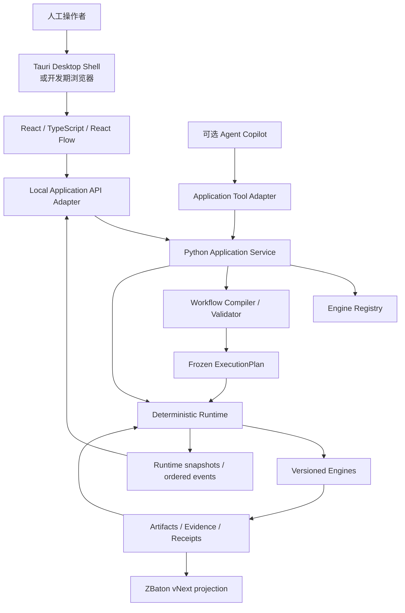
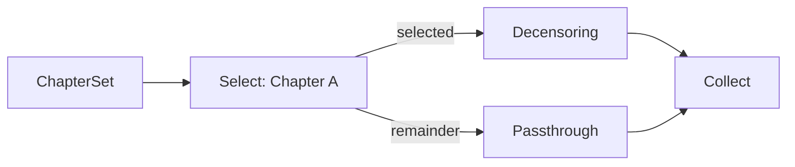
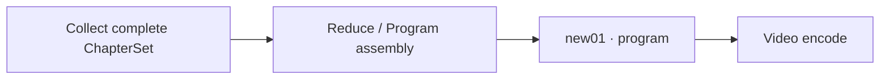
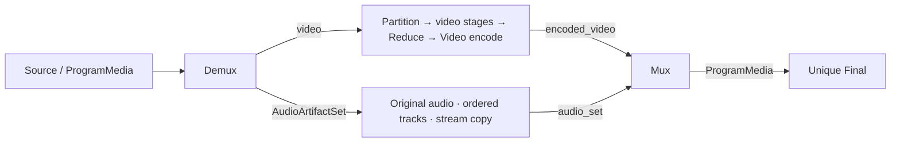
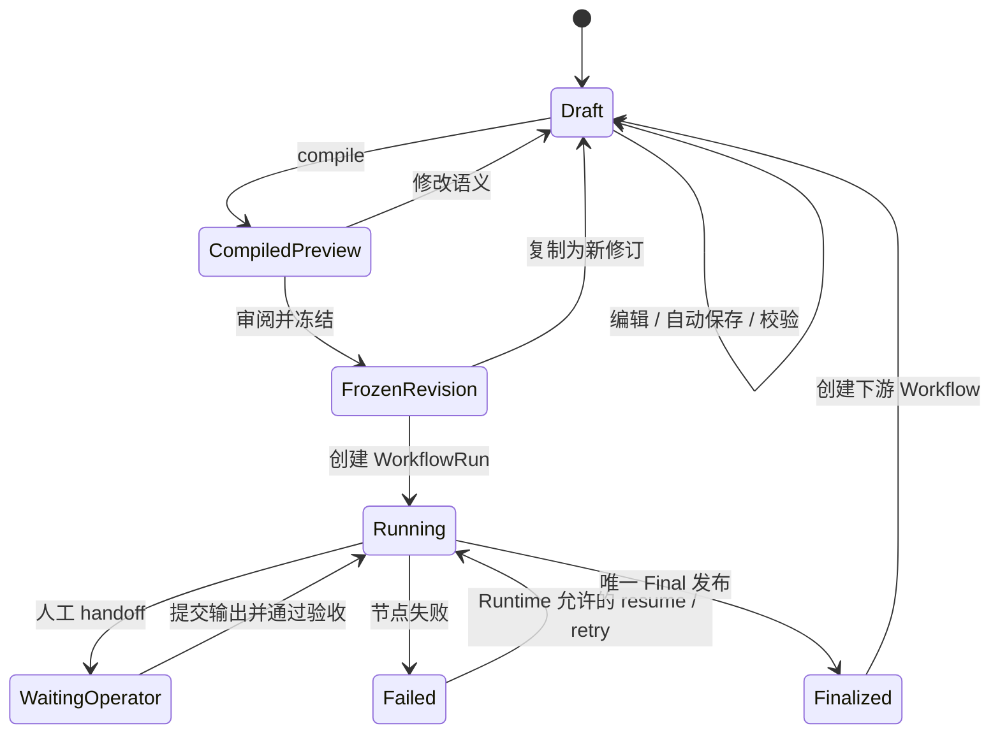

# ZNIKU Studio 0.1.0 整体框架

> [!IMPORTANT]
> **0.1.0 历史归档：** 本文只描述 `main@198d802` 的旧实现，对 0.2.0 没有规范权威。当前唯一目标架构
> 见 [`graph-core-baseline.md`](../../architecture/graph-core-baseline.md)。

- 状态：**正式框架基线；已审阅通过并授权实施**
- Studio 框架修订：1
- 日期：2026-08-14
- 起始版本：ZNIKU 0.1.0
- 上位基线：[`product-framework.md`](./product-framework.md)
- 孵化来源：AVEnhanceFlow v3.0.0 GUI 正式框架

## 1. 文档定位

本文定义 ZNIKU Studio 的产品职责、技术路线、信息架构、交互模型、数据边界、
进程边界、安全边界和实施顺序，作为后续交互原型及正式 Studio 开发的共同基线。

本文重点回答以下问题：

1. GUI 使用什么技术实现；
2. 用户实际看到哪些界面，如何完成工作流编排；
3. 电影级编排 DAG、章节分支和展开后的执行 DAG 如何可视化；
4. GUI、Agent、Compiler、Runtime 和 Engine 各自拥有什么权限；
5. 工作流何时可编辑、何时冻结、如何创建新修订；
6. 如何先讨论和验证 GUI，又不让原型反向成为未经设计的运行协议。

本文已经审阅通过，是 ZNIKU Studio 设计与实施的正式框架基线。后续实现必须遵守本文
冻结的职责、边界和实施顺序；本文尚未冻结的示例对象、接口名称和技术细节，仍需在相应专题设计中
明确后再形成代码 API。实施不得修改 AVEnhanceFlow v2.3.1 package 对 v2.3.0 workflow contract 的
生产行为。

若本文与上位基线冲突，以上位基线为准；若后续确认需要改变上位基线，应先修订并重新审阅上位
文档，再开始实现。

## 2. 技术路线结论

ZNIKU Studio 采用前后端分离的本地桌面应用架构：

| 层 | 首选技术 | 职责 |
| --- | --- | --- |
| 节点编辑器 | React + TypeScript + React Flow | 画布、节点、端口、连线、分支、选择和交互状态 |
| 前端构建 | Vite | 本地开发、测试和静态资源构建 |
| 本地应用 API | Python；首选 FastAPI 作为适配器 | 向 GUI 提供 Registry、Compiler、Runtime 命令和事件 |
| 领域与执行核心 | 纯 Python | WorkflowSpec、Compiler、Runtime、Engine Registry 与 Evidence |
| 桌面封装 | Tauri 2，正式打包阶段引入 | Windows 窗口、原生文件选择、权限和安装包 |
| 开发期承载 | 本地浏览器 | 在不引入桌面封装的情况下验证真实交互 |

技术选择冻结的是职责和方向，不在本文锁定具体依赖版本、包管理器、CSS 方案、前端状态库、
自动布局库或最终安装器。实施时必须锁定精确版本并记录供应链与许可证清单。

### 2.1 为什么不使用 Tkinter

Tkinter 可以完成表单、文件选择和小型固定流程工具，也能用 `Canvas` 手工绘制节点和连线，但 Studio
的核心是可扩展节点编辑器。若使用 Tkinter，需要自行实现并长期维护：

- 无限画布、缩放、平移和坐标变换；
- typed port 命中测试、连线吸附和合法连接反馈；
- 多选、框选、复制、撤销、重做和快捷键；
- 分组、折叠、自动布局、MiniMap 和大型图增量更新；
- 节点属性表单、诊断定位和运行状态叠加；
- UI 线程与长时间任务、事件流之间的隔离。

这些工作不会增强 ZNIKU 的媒体合同、证据或调度能力，因此 Tkinter 不作为正式节点编辑器
技术底座，也不为“临时原型”新增一套最终必须废弃的 Canvas 实现。

### 2.2 为什么选择 React Flow

React Flow 已提供节点式 UI 所需的基础交互和可扩展自定义节点机制，使开发重点可以放在
ZNIKU 的 typed media ports、scope、ArtifactSet、编译诊断和运行监控上。

React Flow 只是视图层，不成为 WorkflowSpec 格式，也不成为 DAG 正确性权威。前端内部的
React Flow `Node` / `Edge` 必须由适配器从正式领域对象投影，不能直接序列化后冒充执行协议。

### 2.3 PySide6 的定位

若未来出现必须纯 Python、禁止 WebView 或无法接受前端工具链的硬性部署条件，备选方案为
PySide6 + Qt Widgets + `QGraphicsScene/QGraphicsView`。它具备实现正式节点编辑器的技术能力，
但需要自行建设更多图编辑器交互，并在专有软件分发前确认 Qt 许可合规。

PySide6 是经过架构评审后才能启用的备选路线，不与 React GUI 并行开发，也不维护两套正式客户端。

## 3. 产品目标与非目标

### 3.1 GUI 的目标

GUI 应让操作者在不手写 JSON 的情况下完成：

- 从 Engine Registry 发现可用处理能力；
- 从模板开始或自由拖放节点；
- 连接带类型、scope 和基数的媒体端口；
- 表达 Partition、Map、Select、Passthrough、Collect、Reduce 和唯一 Final；
- 为全部章节、指定章节或汇合后的 program 安排不同处理链；
- 查看 Engine 版本、参数、媒体指标变化和人工处理要求；
- 定位 cycle、端口不兼容、集合覆盖不完整和多个 Final 等问题；
- 将电影级编排图编译并预览为章节／叶片级 ExecutionPlan；
- 冻结一次不可变 WorkflowRevision 并创建 WorkflowRun；
- 在运行图上查看 ready、running、waiting、verification、failed 和 complete 状态；
- 完成人工 handoff、输出提交、失败检查和 Runtime 允许的恢复动作。

### 3.2 GUI 的非目标

首版明确不提供：

- 在画布中编写任意 Python、Shell、FFmpeg 或 Engine 私有命令；
- 在运行开始后拖线、删除节点或原地改变正式拓扑；
- 让 GUI 自己判断 StageRun 已完成或绕过 full verification；
- 直接控制 Topaz 未公开接口或自动代替人工外部处理；
- 从公网动态下载并立即执行未知 Engine；
- 多用户云协作、移动端编辑或浏览器远程开放访问；
- 完整视频剪辑、调色、时间线编辑或播放器替代品；
- 用 GUI 状态替代 Evidence、receipt、ExecutionPlan 或 Runtime authority。

## 4. 设计原则

1. **业务优先于画布库**：React Flow 服务于 ZNIKU，不反向定义领域协议。
2. **一个正式 Compiler**：GUI 可做即时提示，但正式合法性只由 Python Compiler 判定。
3. **编辑图与执行图分层**：操作者编辑可读的电影级 DAG，Runtime 执行展开后的确定性 DAG。
4. **数据边表达媒体流**：首版编排边表示 Artifact / ArtifactSet 流动，不开放任意控制依赖线。
5. **Registry 驱动扩展**：新增合法 Engine 后，节点面板和属性表单由 manifest 自动生成基础能力。
6. **冻结后只读**：运行监控复用图形视图，但不能修改冻结拓扑。
7. **GUI 可退出**：关闭或崩溃 GUI 不得等同于取消 WorkflowRun。
8. **不以颜色作为唯一语义**：类型、scope、状态和错误必须同时使用文字、图标或形状表达。
9. **默认展示必要信息**：电影级视图保持可读，叶片和低层 Evidence 按需展开。
10. **危险动作由 Runtime 收口**：重试、恢复、发布和取消必须经过正式命令和状态检查。

## 5. 总体架构



GUI 与 Agent 是两个客户端。两者通过不同适配器调用同一 Python 应用服务，不能各自实现一套状态
迁移。应用服务负责授权和用例编排；Compiler、Runtime 和 Registry 保持可脱离 GUI 独立测试。

## 6. 进程与部署边界

### 6.1 开发期

交互原型和早期集成使用以下结构：

```text
Browser
  └─ React development/build UI
       └─ loopback API
            └─ Python application service
```

原型可以使用模拟 Registry、模拟 Compiler 结果和模拟 Runtime 事件，但必须明确标记为 `mock`，不得
处理真实媒体，不得生成可被 Runtime 误认的正式 receipt 或 Evidence。

### 6.2 正式桌面版

正式 Windows 客户端目标结构为：

```text
Tauri desktop shell
  ├─ React static UI
  ├─ native file/dialog capability
  └─ authenticated loopback connection
       └─ independent Python Runtime service
            └─ Engine processes / manual handoffs
```

Tauri 可以负责安装、启动检查和连接本地 Python 服务，但不得成为活动 WorkflowRun 的唯一生命周期
所有者。至少满足：

- 关闭 GUI 不会隐式取消正在运行的节点；
- GUI 重启后可根据正式 run identity 重新连接；
- Runtime 中断后能从持久状态和 Evidence 进行 fresh recovery；
- Engine 子进程的取消、终止和恢复由 Runtime 决定，而不是窗口生命周期决定。

Python Runtime 最终采用独立后台进程、Windows service、任务宿主或其他方式，留待 Runtime 专题设计；
本文件只冻结“GUI 不是运行进程所有者”这一不变量。

## 7. 信息架构

GUI 由一个入口工作台和三个核心图形视图组成：

| 界面 | 主要对象 | 是否可编辑拓扑 | 目的 |
| --- | --- | --- | --- |
| 工作台 | Draft、Revision、Run、模板 | 不适用 | 创建、打开、复制、查找和继续任务 |
| Workflow Designer | 电影级 WorkflowSpec | 冻结前可编辑 | 设计业务拓扑和节点参数 |
| Expanded Plan | 编译后的 ExecutionPlan | 只读 | 检查实际章节／叶片展开和合同结果 |
| Run Monitor | WorkflowRun + StageRun | 只读 | 查看执行、人工 handoff、验证、失败和恢复 |

三个图形视图可以复用同一画布基础组件，但必须使用不同的交互权限和数据模型，不能用一个
`editable` 布尔值掩盖所有状态差异。

### 7.1 工作台

工作台至少展示：

- Workflow 名称和 identity；
- 当前 Draft 或已冻结 Revision；
- 最近一次编译结果；
- 已绑定 source 摘要；
- 是否存在活动 Run；
- 最后状态和下一项人工动作；
- 创建下游 Workflow、复制为新 Draft 和打开只读历史的入口。

### 7.2 Workflow Designer

Designer 回答“我想让这部电影经过什么处理”。默认不展开每个 chapter/leaf，只展示用户真正设计的
电影级节点、选择范围和汇合关系。

### 7.3 Expanded Plan

Expanded Plan 回答“Compiler 最终准备执行什么”。它展示绑定 source 后生成的实际 chapter、leaf、
StageRun、集合屏障和 Engine 精确版本。任何与用户预期不一致的展开都应在冻结前被看见。

### 7.4 Run Monitor

Run Monitor 回答“现在执行到哪里、为什么停下、下一步允许做什么”。它消费 Runtime snapshot 和有序
事件，不从目录、文件名或前端缓存猜测正式状态。

## 8. 主窗口布局

首版采用稳定的四区布局：

```text
┌────────────────────────────────────────────────────────────────────────────┐
│ Workflow / Revision │ Designer · Plan · Run │ Save │ Compile │ Freeze/Run │
├───────────────────┬───────────────────────────────────┬────────────────────┤
│ Engine / Operator │                                   │ Inspector          │
│ Palette           │            Graph Canvas           │                    │
│                   │                                   │ node / edge / run  │
│ Search            │                                   │ properties         │
│ Categories        │                                   │                    │
├───────────────────┴───────────────────────────────────┴────────────────────┤
│ Diagnostics / Media change summary / Handoff / Runtime event details       │
└────────────────────────────────────────────────────────────────────────────┘
```

- **顶部栏**：显示 Workflow identity、修订、未保存状态、当前模式和允许的主动作。
- **左侧面板**：从 Registry 加载 Source、图操作、媒体 Engine、模板和搜索结果。
- **中央画布**：显示节点、typed ports、媒体边、分支、选择范围和状态叠加。
- **右侧 Inspector**：编辑所选节点参数，或只读显示 ExecutionPlan / StageRun 细节。
- **底部抽屉**：承载诊断、媒体变化摘要、人工 handoff、日志尾部和恢复说明。

面板可调整宽度和折叠；布局属于 `EditorState`，不改变 WorkflowSpec 语义。

## 9. 图形语言

### 9.1 节点类别

| 类别 | 示例 | 视觉身份 | 语义 |
| --- | --- | --- | --- |
| Source / Binding | Source、Inherited Final | 输入形节点 | 引入 program 媒体或上游 final |
| Graph Operator | Partition、Map、Select、Collect、Reduce | 结构形节点 | 改变集合、范围或图结构 |
| Media Engine | Demux、Enhancement、Frame interpolation、Video encode、Mux | 处理形节点 | 改变、分离或合成媒体 |
| Final | Unique Final | 唯一终端形节点 | 正式发布 WorkflowRun 输出 |

图操作与媒体 Engine 必须在视觉上可区分，避免操作者把 `Collect` 误认为某种媒体算法，或把
Enhancement 误认为只负责结构路由。

### 9.2 节点卡片的最小信息

Designer 中的节点卡片默认只显示：

```text
[scope]  Display name
         engine_id @ version 或 operator kind
input ports                    output ports
[manual] [media effects summary] [diagnostic badge]
```

详细参数、manifest digest、完整媒体合同和 Evidence 不挤入节点正文，在 Inspector 中查看。

### 9.3 Typed ports

每个端口至少表达：

- artifact 类型，例如 video、audio、program media 或 metadata；
- scope，例如 program、chapter 或 leaf；
- 基数，例如单一 Artifact、可选 Artifact 或 ArtifactSet；
- 输入或输出方向；
- 端口稳定 ID，而不是只依赖可变显示名称。

节点必须支持多个命名输入和输出端口。GUI 不得把 `program_media`、`video` 与 `audio_set` 简化为一个
通用 `video+audio` 端口；例如 Demux 同时显示 `video`、`audio_set` 输出，Mux 同时显示
`encoded_video`、`audio_set` 输入。多端口节点的 Handle、端口标签和 Inspector 条目必须一一对应，
连线保存稳定 port ID，而不是依赖 Handle 的屏幕坐标。

端口兼容性由 Compiler 最终判定。画布可根据 Registry 做即时吸附和拒绝提示，但不能据此声明工作流
已经合法。

### 9.4 边

Designer 中的边表示媒体 Artifact 或 ArtifactSet 的流动，不表示“等一会儿再执行”之类任意控制线。
边的显示标签可按需展示媒体类型、scope、集合身份或 selector 结果。

默认工作流必须显式显示原始音频支线。即使音频完全不处理，也要从 Demux 的 `audio_set` 输出连到
Mux 的同名输入，并显示音轨数量、原始顺序和 `stream copy` 摘要；不得用节点文字中的
`audio: passthrough` 代替正式数据边。长距离音频旁路可以使用独立轨道样式和 MiniMap 辅助阅读，
但仍是普通 WorkflowSpec 媒体边，不是隐藏控制线。

Compiler 为恢复、屏障或内部执行生成的控制依赖，只在 Expanded Plan 中以只读辅助线显示，不写回
WorkflowSpec 的业务边。

### 9.5 Scope 与集合

节点右上角使用明确文字徽章显示 `program`、`chapter`、`leaf` 或 selector 摘要。集合端口使用叠层
图标并显示成员计数，例如 `ChapterSet · 3`。

颜色只能辅助区分，不作为唯一编码。所有关键语义必须能通过节点名称、端口标签和可访问文本读取。

## 10. 分层 DAG 的可视表达

### 10.1 Designer 保持电影级可读

用户不应为了对 12 个章节执行同一个 Enhancement，就在 Designer 中手工复制 12 个节点。
`Map: Enhancement / all chapters` 在电影级画布中表现为一个组合节点；其内部含义由 WorkflowSpec 和
Compiler 明确表达，而不是由 GUI 临时猜测。

### 10.2 Select 必须显式覆盖剩余成员

`Select` 节点至少提供 `selected` 与 `remainder` 两类输出，使“只处理 Chapter A”不会无意丢失其他
章节：



Collect 卡片应显示覆盖摘要，例如 `expected 3 / received 3 / duplicate 0`。缺失、重复、顺序不明或
媒体合同不兼容时，诊断必须绑定到 Collect 及具体输入边。

### 10.3 汇合后允许继续 program 级处理

Reduce 将完整有序 ChapterSet 汇合为一个 program Artifact 后，可以继续连接任意兼容的
program-scope Engine，再进入唯一 Final：



该链路此时仍是 program video；只有 Mux 与所需音频／其他轨道合成后，才产生可交给 Final 的
ProgramMedia。若 `new01` 的 EngineManifest 声明消费完整 ProgramMedia，则必须把它放在兼容的 Mux
之后，不能由 GUI 猜测或隐式接入音频。

### 10.4 音视频分离与重新合成必须可见

默认模板采用两条独立媒体支线：



- Demux 是容器分离 Engine，不是纯视觉分组；
- video Engine 默认不携带或旁路音频，除非其 manifest 明确声明相应端口；
- AudioArtifactSet 保留稳定成员 ID、音轨顺序、codec、language、disposition 与直接 source lineage；
- 需要音频处理时，可在该支线上插入 Select／Map、Audio Engine 与 Collect；
- Mux 负责容器合成和轨道绑定，Final 只执行唯一终端发布，二者不得合并为模糊节点。

### 10.5 Expanded Plan 展示真实分叉

Expanded Plan 允许按以下层级展开：

```text
Movie workflow node
└─ chapter instances
   └─ leaf instances
      └─ internal handoff / verification / publication lifecycle
```

默认展开到 chapter，leaf 按需加载。用户可以按 chapter、Engine、状态或错误筛选，避免长片执行图一次
渲染全部低层节点。

## 11. Designer 交互模型

### 11.1 新建与模板

操作者可以：

- 新建空白 Workflow Draft；
- 从“默认 Demux → Enhancement → Frame interpolation → Video encode，并行原始音频旁路 → Mux →
  Final”模板开始；
- 从现有 Revision 复制为新 Draft；
- 从上游 Workflow Final 创建下游 Workflow；
- 导入合法 WorkflowSpec，但导入后仍需重新解析 Registry 和编译。

模板不保存真实媒体路径、凭据、授权、模型安装目录或本机可执行文件位置。

### 11.2 添加节点

左侧 Palette 依据 Registry 分为：

- Sources；
- Graph Operators；
- Video Engines；
- Audio Engines；
- Assembly / Encode / Mux；
- Final；
- 用户收藏和最近使用。

Engine 节点显示精确版本和安装状态。缺失 Engine 可以作为只读占位符打开旧 Draft，但不能通过预检
或冻结门。

### 11.3 连接节点

拖线时：

1. 高亮可能兼容的目标端口；
2. 对明显不兼容连接立即给出说明；
3. 允许 Draft 暂时存在悬空端口；
4. 将实际连接提交给 Python Compiler；
5. 使用 Compiler 返回的稳定诊断更新节点、端口和边。

前端不得通过删除后端拒绝的诊断、修改 severity 或本地强制连线，让非法图进入冻结状态。

### 11.4 编辑参数

右侧 Inspector 根据 EngineManifest 参数 Schema 生成基础表单，并允许 Engine 提供受控的专用呈现器。
表单至少支持：

- 必填、可选、默认值和枚举；
- 数值范围、单位和精度；
- 媒体倍率、分辨率、帧率等专用显示；
- Engine 版本选择与升级影响提示；
- 人工外部阶段的模型名称和版本绑定位置；
- 参数改变前后的媒体效果摘要。

专用呈现器只能改善输入体验，不能扩大 Schema 允许的值域或携带可执行代码。

### 11.5 画布操作

首版应具备：

- 拖动、缩放、平移、框选和多选；
- 复制、粘贴、删除、撤销和重做；
- 对齐、适配视图和基础自动布局；
- MiniMap 和节点搜索；
- 跳转到诊断实体；
- 折叠／展开组合节点；
- 键盘可达和常用快捷键说明。

自动布局只改变 EditorState，不重排 ArtifactSet 的业务顺序，也不改变 ExecutionPlan。

## 12. 媒体变化摘要

GUI 不应只展示 Engine 名称，还应在冻结前用简洁语言汇总重要媒体变化。每个节点至少区分：

- 保持不变；
- 按合同改变；
- 由操作者待确认；
- Engine 无法保证，需下游验证；
- Compiler 判定不兼容。

示例：

```text
Enhancement · Starlight Precise 2.6
video: 1920×1080 → 3840×2160（整数各向同性 x2）
fps: 30000/1001 → 30000/1001（保持）
audio: not connected（video-only Engine；原始音轨走独立支线）
execution: manual external
```

媒体变化摘要来自 EngineManifest、参数、输入媒体绑定和 Compiler 推导。GUI 不自行发明输出分辨率、
帧率或声道结果。

## 13. 校验与诊断模型

校验分为四层：

| 层 | 时机 | 能否成为正式结论 | 示例 |
| --- | --- | --- | --- |
| 交互提示 | 拖动和输入时 | 否 | 自连接、明显端口类型错误 |
| Draft validation | 自动或手动 | 否，允许继续编辑 | cycle、悬空必需端口、多个 Final |
| Compile / Preflight | 绑定 source 与 Registry 后 | 是，决定能否冻结 | selector 覆盖、媒体合同、Engine digest |
| Freeze gate | 创建 Revision / Run 前 | 是，决定能否产生副作用 | 未确认参数、计划摘要、authority |

诊断对象至少应具备：

```text
diagnostic_id
stable_code
severity
message
entity_ref      node / port / edge / parameter / expanded instance
details
suggested_action（可选）
```

前端将诊断投影到：

- 节点或端口徽章；
- 问题边高亮；
- 底部诊断列表；
- Inspector 具体字段；
- Expanded Plan 的实际 chapter/leaf 实例。

GUI 可以提供“定位”和安全的“建议修正”，但不得提供忽略 fail-closed 错误的按钮。

## 14. GUI 数据边界

### 14.1 正式领域对象

GUI 消费或提交的主要对象包括：

| 对象 | 所有者 | GUI 权限 |
| --- | --- | --- |
| `EngineManifest` | Registry | 只读 |
| `WorkflowDraft` | Authoring service | 创建和修改 |
| `WorkflowSpec` | Workflow domain | 通过正式命令保存 |
| `WorkflowRevision` | Workflow domain | 只读、不可变 |
| `ExecutionPlan` | Compiler | 只读、不可变 |
| `WorkflowRun` / `StageRun` | Runtime | 只读状态 + 受控命令 |
| `Artifact` / Evidence / receipt | Runtime / Engine | 只读摘要和打开位置 |
| `ZBaton vNext` | History projector | 只读预览或交付 |

### 14.2 EditorState

以下内容属于可变的 `EditorState`，不进入 ExecutionPlan digest：

- 节点坐标和尺寸；
- 画布 viewport；
- 面板宽度和折叠状态；
- MiniMap、网格和显示偏好；
- 组合节点是否展开；
- 用户选择和临时搜索条件。

冻结后的 WorkflowRevision 仍可调整 EditorState，以改善查看体验；只要没有改变节点、边、参数、
selector、Engine 绑定或其他执行语义，就不创建新 WorkflowRevision。

### 14.3 React Flow 适配层

前端维护显式适配器：

```text
WorkflowDraft / ExecutionPlan / RuntimeSnapshot
                 ⇅
          Graph View Model
                 ⇅
        React Flow Node / Edge
```

React Flow 的坐标、选中、拖动和 DOM 数据不得泄漏到 Python 领域模型；领域 ID 也不能依赖 React
组件生命周期临时生成。

## 15. 修订、冻结与运行生命周期



冻结门前，GUI 必须显示：

- source 和 chapter plan 摘要；
- Engine ID、精确版本和 manifest digest；
- 实际展开的节点和分支数量；
- 重要媒体变化；
- 人工 external stage 清单；
- warnings 与全部待确认事项；
- ExecutionPlan digest。

冻结后：

- Designer 切换为只读；
- “保存修改”变为“复制为新 Draft”；
- Run Monitor 只显示 Runtime 允许的动作；
- 不提供解除冻结后原地继续的入口。

## 16. Run Monitor

### 16.1 状态表达

Run Monitor 至少区分以下概念状态，正式枚举由 Runtime 专题设计冻结：

```text
pending
ready
running
waiting_operator
accepting_output
verifying
publishing
complete
failed
blocked
cancelled
```

节点卡片同时显示状态文字、图标和时间摘要。进度百分比仅在 Engine 能提供可靠分母时展示；不把
FFmpeg 日志中的估算值冒充正式完成度。

### 16.2 人工阶段

人工 Enhancement、Frame interpolation 或未来 Decensoring 的 handoff 面板至少展示：

- 精确输入 Artifact 和只读路径；
- 目标输出位置和命名要求；
- 操作者需使用的模型、版本和参数；
- 预期分辨率、帧率、帧数和音频规则；
- 当前 authority 和提交截止条件；
- “提交输出供验收”，而不是“标记节点完成”。

用户提交输出后，Runtime 必须执行稳定读取、完整验证和 no-replace publication。只有正式证据成功后，
节点才显示 `complete`。

### 16.3 失败与恢复

失败节点提供：

- 人类可读原因；
- 稳定错误码；
- 失败发生的生命周期阶段；
- 已发布、可复用和必须重做的 Artifact；
- Runtime 当前允许的 inspect、resume、retry 或创建新修订动作；
- 有界日志尾部和正式 Evidence／receipt 链接。

GUI 不提供直接删除正式输出、覆盖现有媒体、手改 sidecar 或跳过验证继续的快捷入口。

## 17. 本地 API 与事件模型

本文不冻结具体 URL，但冻结以下用例边界：

```text
registry
  list engines / inspect manifest

authoring
  create draft / apply edit / save / clone / import / export

compiler
  validate / compile / inspect diagnostics / inspect expanded plan

binding
  bind source / inspect media / resolve confirmations

revision
  freeze / inspect revision / compare revisions

runtime
  start / inspect / list ready / execute / submit external output / resume / retry

events
  subscribe / reconnect from sequence / obtain current snapshot
```

接口原则：

- 所有有副作用命令带稳定 command identity 或 idempotency key；
- 写命令返回最新 authority identity，不依赖前端乐观状态成为事实；
- 事件包含 run identity、单调序号和可恢复游标；
- 前端断线后先拉取 fresh snapshot，再从游标补充事件；
- OpenAPI／JSON Schema 可用于生成 TypeScript 类型，但 Python 领域模型仍是合同源；
- GUI 不能通过 API 提交任意可执行字符串或未注册 Engine 入口。

事件传输首选 SSE 或 WebSocket，最终根据 Runtime 事件语义、断线补发和测试复杂度决定。状态改变必须
可以仅通过普通请求／响应接口完成；事件流是及时显示机制，不是唯一 authority。

## 18. 安全边界

### 18.1 本地连接

- 正式 API 默认只监听 loopback，不开放 LAN；
- 桌面客户端与 API 使用短期会话令牌或等效本地认证；
- 禁止宽泛 CORS 和任意网页调用 Runtime；
- 端口、令牌和进程身份不写入可共享 WorkflowSpec；
- GUI 静态资源使用严格 CSP，不动态加载远程脚本。

### 18.2 Engine 与命令

- 只显示并调用已安装、allowlisted 且 digest 匹配的 Engine；
- WorkflowSpec 只保存 Engine identity、版本和 Schema 内参数；
- Engine 可执行位置和系统权限由 Runtime policy 决定；
- Tauri 原生能力使用最小 capability scope；
- 文件选择只提供候选路径，Python 后端仍需重新解析、探测并绑定 authority。

### 18.3 路径与敏感信息

- 模板不得携带绝对媒体路径、凭据、授权或设备秘密；
- 展示路径时区分输入、工作区、正式输出和外部 handoff；
- 可复制路径不等于可写权限；
- 导出诊断包前必须过滤真实媒体、敏感日志和本机配置。

## 19. 性能与可用性

### 19.1 大图策略

电影级 Designer 通常只有少量语义节点，但 Expanded Plan 可能产生大量 chapter/leaf 实例。因此：

- 默认只渲染电影级或 chapter 级；
- leaf 按节点、章节或错误按需加载；
- 运行事件采用增量更新，不整图重建；
- 大型列表和日志使用虚拟化；
- 自动布局在后台计算，失败不改变业务图；
- 图像缩略图和视频预览不是默认渲染负担。

### 19.2 可访问性与可读性

- 节点、端口和主动作支持键盘导航；
- 状态、错误和 scope 不只依靠颜色；
- 支持缩放、适配视图和高 DPI；
- 中文业务名称与英文协议标识可以同时查看；
- 错误先说明影响，再给出定位和下一步；
- 默认隐藏低层诊断，允许专家展开完整合同和原始 JSON。

## 20. 原型与正式实现的关系

可以先讨论并制作 GUI，但必须区分两类产物：

### 20.1 交互原型

交互原型用于验证：

- 页面布局和导航；
- 节点卡片信息密度；
- 分章、Select、Passthrough、Collect 的理解成本；
- Designer 与 Expanded Plan 的切换；
- 冻结确认和 Run Monitor 的交互；
- 诊断是否能准确定位到节点、端口和边。

原型使用 mock contracts，不执行媒体，不被生产 Runtime 接受。原型中验证成功的交互可以保留，但
mock JSON 不自动升级为 WorkflowSpec 标准。

### 20.2 正式 GUI

正式 GUI 必须在 WorkflowSpec、EngineManifest 和 Compiler 接口稳定后接入真实后端。它只能消费正式
Schema、诊断和 Runtime 命令，不能复制 mock 逻辑形成第二套合同。

因此，GUI 的设计讨论和交互原型可以提前；正式执行接入仍遵守“合同和 Compiler 先稳定”的实施顺序。

## 21. 建议实施阶段

### GUI-0：审阅与交互原型

- 审阅并冻结本文；
- 使用模拟 Registry 制作可点击原型；
- 验证默认流程、章节分支、汇合、冻结和监控模式；
- 不连接真实 Runtime，不处理真实媒体。

### GUI-1：前端基础设施

- 建立 React + TypeScript + React Flow 工程；
- 建立 Graph View Model 与 React Flow 适配器；
- 实现主布局、Palette、Canvas、Inspector 和 Diagnostics；
- 建立组件测试、可访问性检查和 mock E2E。

### GUI-2：WorkflowSpec 与 Registry 集成

- 从 Python Schema / OpenAPI 生成或校验 TypeScript 类型；
- 接入正式 Engine Registry；
- 实现 Draft 保存、导入、导出和 EditorState；
- 接入唯一 Python validation / compile 接口。

### GUI-3：Expanded Plan 与冻结

- 实现 source binding 和 chapter 展开；
- 显示媒体变化、Engine digest、人工阶段和诊断；
- 实现只读 Expanded Plan；
- 实现 Revision freeze 和 plan digest 审阅。

### GUI-4：Run Monitor

- 接入 Runtime snapshot 和有序事件；
- 实现 ready、running、waiting、verifying、failed 和 complete 显示；
- 实现人工 handoff、输出提交和受控恢复动作；
- 验证 GUI 重启和事件断线恢复。

### GUI-5：Tauri 桌面封装

- 集成原生文件选择和最小 capability；
- 建立 Python Runtime 服务发现和连接；
- 打包 Windows 安装产物；
- 验证关闭 GUI 不取消活动 Run；
- 完成许可证、SBOM、签名和升级策略。

### GUI-6：正式验收

- 使用合成媒体和短真实媒体验证 GUI → Compiler → Runtime；
- 完成故障注入、恢复、no-replace 和 full verification 验证；
- 验证 AVEnhanceFlow v2.3.1 package 的 v2.3.0 workflow contract 未被迁移或改变；
- 获得明确授权后再进入提交、发布和安装流程。

## 22. 测试策略

### 22.1 前端单元与组件测试

- Node / Port / Edge 视图模型投影；
- Inspector Schema 表单；
- 诊断定位；
- 冻结后的只读权限；
- EditorState 与 WorkflowSpec 隔离；
- 状态、图标和可访问文本一致。

### 22.2 合同测试

- Python 生成的 Schema 与 TypeScript 类型兼容；
- 同一 fixture 在 CLI、Agent adapter 和 GUI 中得到相同 Compiler 结果；
- React Flow 序列化数据不能直接通过正式 WorkflowSpec validator；
- 未知 Engine、错误 digest 和不兼容端口 fail closed。

### 22.3 端到端测试

- 创建 Draft、添加节点、连接、编译、冻结和创建模拟 Run；
- 断线重连后状态不回退、不重复执行命令；
- 人工完成消息只触发输出验收；
- GUI 崩溃或关闭后 Runtime 状态保持完整；
- 新修订显式复用 Artifact，不修改旧 Run；
- final 后只能创建下游 Workflow。

### 22.4 视觉回归

- 典型窗口尺寸和高 DPI；
- 中英文长标签；
- 大型 chapter 图；
- warning、failed、blocked 和 waiting_operator 状态；
- 键盘焦点和非颜色辨识。

## 23. 首版验收场景

GUI 框架至少通过以下场景，才说明技术路线和交互模型成立：

1. 从模板打开默认 Demux → 视频处理／原始音频旁路 → Video encode → Mux → Final 工作流。
2. 将 source 绑定为三个章节，并在 Expanded Plan 中看到三个实际分支。
3. 只对 Chapter A 插入 Decensoring，remainder 自动或显式进入 Passthrough。
4. Collect 显示完整覆盖；删除 remainder 边后立即定位集合缺失。
5. Reduce 后添加一个新的 program-video-scope `new01` Engine，再经 Video encode 与 Mux 连接唯一
   Final。
6. 创建 cycle、连接错误 scope、产生两个 Final 时，Compiler 均 fail closed 并精确定位。
7. 冻结前显示 Engine 版本、媒体变化、人工阶段和 ExecutionPlan digest。
8. 冻结后无法拖线或修改参数，只能复制为新 Draft。
9. Run Monitor 模拟人工输出提交，并在 verification 成功前保持非 complete。
10. 关闭并重开 GUI 后，通过 run identity 恢复同一只读运行状态。
11. Registry 新增一个符合合同的 Engine 后，Palette 和基础 Inspector 无需修改核心前端分支即可显示。
12. 任何 GUI 操作都不能覆盖正式 Artifact、跳过 full verification 或修改旧 Revision。
13. 删除 Demux → Mux 的原始音频边、交换音轨顺序或连接错误 audio port 时，Compiler 必须
    fail closed；正常旁路则在 Mux 和冻结门显示全部原始音轨与 `stream copy`。

## 24. 备选方案决策记录

| 方案 | 结论 | 原因 |
| --- | --- | --- |
| Tkinter | 拒绝作为正式 GUI | 需要重建节点编辑器基础设施，长期成本与核心业务无关 |
| PySide6 | 保留为受条件约束的备选 | 原生且全 Python，但图编辑能力需更多自建，并有分发许可评审 |
| React Flow + Browser | 采用为原型与开发形态 | 最快验证节点交互，不提前引入桌面打包复杂度 |
| React Flow + Tauri 2 | 采用为正式桌面目标 | 保留 Web 节点生态，同时提供 Windows 原生窗口和权限边界 |
| Electron | 首版不采用 | 能力足够，但当前没有引入完整 Chromium/Node 桌面运行时的必要性 |
| GUI 与 Runtime 同进程 | 拒绝 | GUI 生命周期会威胁长任务、恢复和状态 authority |

## 25. 待后续专题冻结

本文有意不提前确定：

- WorkflowSpec、EditorState、Diagnostic 和 RuntimeEvent 的精确 JSON 字段；
- React、React Flow、Vite、Tauri 和 FastAPI 的精确版本；
- npm、pnpm 或其他前端包管理器；
- CSS、组件库、图标库和视觉品牌；
- Zustand、Redux 或其他前端状态方案；
- Dagre、ELK 或其他自动布局实现；
- SSE 与 WebSocket 的最终选择；
- Python Runtime 的后台进程／Windows service 实现；
- 本地数据库、事件日志和缓存的物理格式；
- Engine 专用 Inspector renderer 的扩展 API；
- 大规模 ExecutionPlan 的分页和增量协议；
- Workflow revision diff 和 Artifact reuse 的最终视觉表现；
- 下游 Workflow 继承历史的导航方式。

这些项目必须在相应领域合同明确后逐项设计和测试，不能由前端先行私自冻结。

## 26. 审阅结论

本文件已经审阅通过，并确认：

1. 是否正式采用 React + TypeScript + React Flow；
2. 是否接受 Python 核心通过本地 API 与 GUI 解耦；
3. 是否接受开发期浏览器、正式阶段再引入 Tauri 2；
4. 是否接受 GUI 关闭不影响 Runtime 的独立进程原则；
5. 是否接受 Designer、Expanded Plan、Run Monitor 三种权限不同的图形视图；
6. 是否接受 WorkflowSpec 与 EditorState 分离；
7. 是否接受交互原型可以提前，但不得连接真实媒体执行；
8. 是否接受本文列出的首版范围、非目标和实施阶段。

GUI-0 原型已作为 ZNIKU 0.1.0 起始资产迁入本仓库。它仍保持 mock-only，不得连接真实媒体执行；
后续阶段依照本基线继续实施，Git 与发布动作仍遵守项目授权规则。

## 27. 参考资料

- [React Flow 官方文档](https://reactflow.dev/)
- [React Flow Custom Nodes](https://reactflow.dev/learn/customization/custom-nodes)
- [React Flow Built-In Components](https://reactflow.dev/learn/concepts/built-in-components)
- [Tauri 2 Process Model](https://v2.tauri.app/concept/process-model/)
- [Tauri 2 Embedding External Binaries](https://v2.tauri.app/develop/sidecar/)
- [FastAPI WebSockets](https://fastapi.tiangolo.com/advanced/websockets/)
- [Python tkinter threading model](https://docs.python.org/3/library/tkinter.html#threading-model)
- [Qt for Python Graphics View Framework](https://doc.qt.io/qtforpython-6.8/overviews/qtwidgets-graphicsview.html)
- [Qt for Python licensing](https://doc.qt.io/qtforpython-6.10/commercial/index.html)
